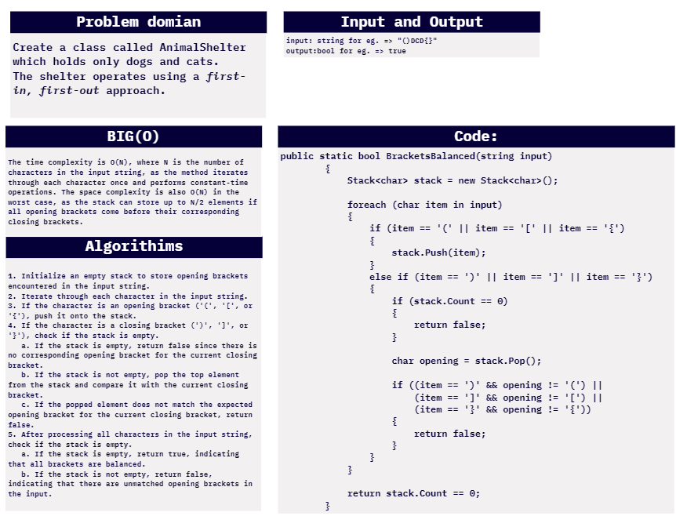
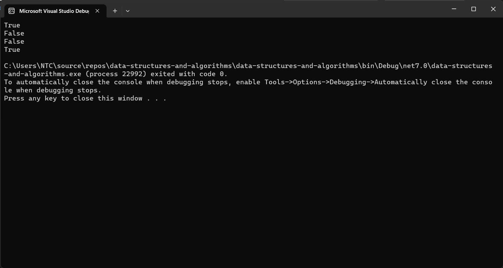
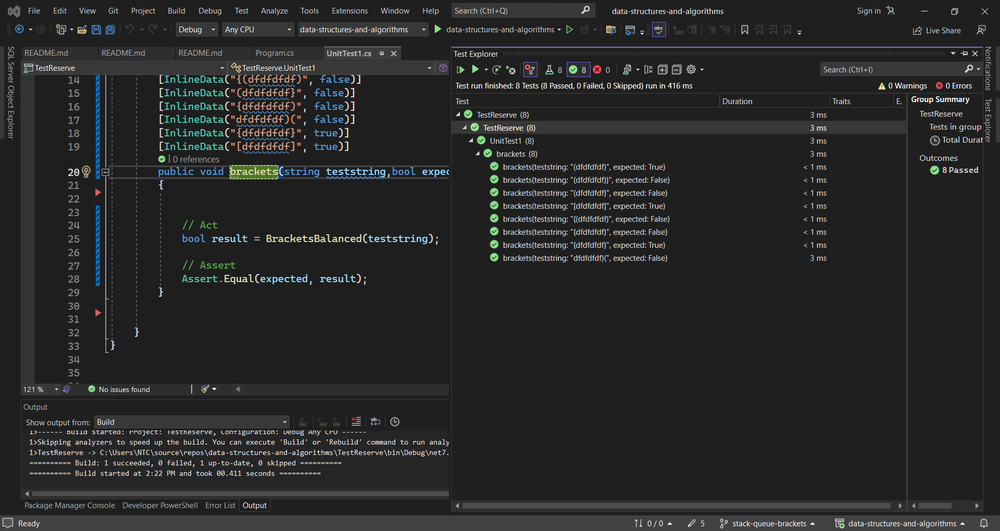

# challenge (13) : Brackets Balanced
## explanation
this is a code for an animal shelter that takes the objects and add them as an queue and stores them individually as into 2 queues :  dogs and cats.

## whiteboard:




## walkthrough :

 walkthrough of the code:


The AnimalShelter class is the main component of the Animal Shelter. It has two private Queue<Animal> objects, dogs, and cats, to hold dogs and cats respectively.

The Enqueue method takes an Animal object and adds it to the appropriate queue based on its species.

The Dequeue method takes a preference ("dog" or "cat") and dequeues an animal from the corresponding queue. If no matching animal is found, it returns null

## code:
```c#

using System.Collections.Generic;

namespace data_structures_and_algorithms
{


    public class Program
    {
        static void Main(string[] args)
        {
            AnimalShelter shelter = new AnimalShelter();

            shelter.Enqueue(new Animal("dog", "taz"));
            shelter.Enqueue(new Animal("dog", "nody"));
            shelter.Enqueue(new Animal("cat", "olive"));
            shelter.Enqueue(new Animal("cat", "carmel"));

            Animal dequed1=shelter.Dequeue("cat");
            Console.WriteLine($" Species: {dequed1.Species}, Name: {dequed1.Name}");
            Animal dequed2 = shelter.Dequeue("dog");
            Console.WriteLine($" Species: {dequed2.Species}, Name: {dequed2.Name}");
                   Animal dequed3 = shelter.Dequeue("cat");
            Console.WriteLine($" Species: {dequed3.Species}, Name: {dequed3.Name}");
            Animal dequed4 = shelter.Dequeue("dog");
            Console.WriteLine($" Species: {dequed4.Species}, Name: {dequed4.Name}");

        }
        public class Queue<T>
        {
            private class Node
            {
                public T Data { get; set; }
                public Node Next { get; set; }

                public Node(T data)
                {
                    Data = data;
                    Next = null;
                }
            }

            private Node front;
            private Node rear;

            public Queue()
            {
                front = null;
                rear = null;
            }

            public void Enqueue(T item)
            {
                var newNode = new Node(item);
                if (rear == null)
                {
                    front = rear = newNode;
                    return;
                }

                rear.Next = newNode;
                rear = newNode;
            }

            public T Dequeue()
            {
                if (front == null)
                {
                    throw new InvalidOperationException("Queue is empty.");
                }

                T data = front.Data;
                front = front.Next;

                if (front == null)
                {
                    rear = null;
                }

                return data;
            }

            public bool IsEmpty()
            {
                return front == null;
            }
        }

        public class AnimalShelter
        {
            private Queue<Animal> dogs;
            private Queue<Animal> cats;

            public AnimalShelter()
            {
                dogs = new Queue<Animal>();
                cats = new Queue<Animal>();
            }

            public void Enqueue(Animal animal)
            {
                if (animal.Species == "cat")
                {
                    cats.Enqueue(animal);
                }
                else if (animal.Species == "dog")
                {
                    dogs.Enqueue(animal);
                }

            }

            public Animal Dequeue(string pref)
            {
                if (pref == "dog")
                {
                    return dogs.Dequeue();
                }
                else if (pref == "cat")
                {
                    return cats.Dequeue();
                }
                return null;
            }
        }

        public class Animal
        {
            public string Species { get; set; }
            public string Name { get; set; }

            public Animal(string species, string name)
            {
                Species = species;
                Name = name;
            }
        }


    }

 

}

```
## test unit:



```c#
using data_structures_and_algorithms;
using System.Collections;
using System.Collections.Generic;
using static data_structures_and_algorithms.Program;

namespace TestReserve
{

    public class UnitTest1
    {
        [Fact]
        public void AddingToCatsAndDogsAndDequeueCat()
        {
            AnimalShelter shelter = new AnimalShelter();
            shelter.Enqueue(new Animal("dog", "taz"));
            shelter.Enqueue(new Animal("dog", "nody"));
            shelter.Enqueue(new Animal("cat", "olive"));
            shelter.Enqueue(new Animal("cat", "carmel"));

            Animal res = new Animal("cat", "olive");
            Assert.Equal(res.Name, shelter.Dequeue("cat").Name);
        }

        [Fact]
        public void AddingToCatsAndDogsAndDequeueDog()
        {
            AnimalShelter shelter = new AnimalShelter();
            shelter.Enqueue(new Animal("dog", "taz"));
            shelter.Enqueue(new Animal("dog", "nody"));
            shelter.Enqueue(new Animal("cat", "olive"));
            shelter.Enqueue(new Animal("cat", "carmel"));

            Animal res = new Animal("dog", "taz");
            Assert.Equal(res.Name, shelter.Dequeue("dog").Name);
        }  [Fact]
        public void DequeueReturnNull()
        {
            AnimalShelter shelter = new AnimalShelter();
            shelter.Enqueue(new Animal("dog", "taz"));
            shelter.Enqueue(new Animal("dog", "nody"));
            shelter.Enqueue(new Animal("cat", "olive"));
            shelter.Enqueue(new Animal("cat", "carmel"));

            Assert.Equal(null, shelter.Dequeue("rabbits"));
        }
    }
}
```
