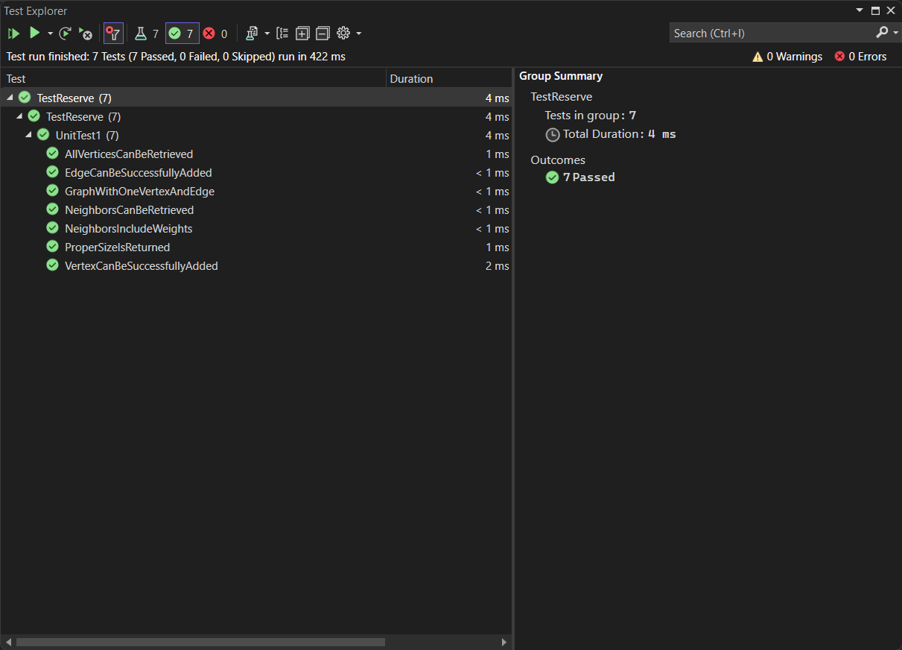

# Graph Implementation in C#

## Overview
This C# code demonstrates the implementation of a graph data structure. It includes the creation of vertices and edges, as well as various operations on the graph, such as adding vertices, adding edges, retrieving vertices, and more.

## Table of Contents
- [Explanation](#explanation)
- [Code](#code)
- [Usage](#usage)
- [Tests](#tests)

## Explanation
This code defines a graph data structure where vertices and edges are represented using C# classes. It allows you to create a graph, add vertices and edges, retrieve information about the graph, and print the graph's contents.

### Code Structure
- The code is organized into three main classes: `Vertex`, `Edge`, and `Graph`.
- `Vertex<T>` represents a vertex in the graph and holds its value.
- `Edge<T>` represents an edge between two vertices and includes a weight.
- `Graph<T>` is the main class representing the graph. It includes methods to add vertices, add edges, retrieve vertices, get neighbors of a vertex, and more.

### Main Method
- The `Main` method serves as the entry point of the program.
- It demonstrates the usage of the `Graph` class by creating a graph with cities as vertices and distances as edge weights.
- The program prints information about the graph, such as vertices, neighbors of a specific vertex, and the size of the graph.

### How It Works (Step by Step)

1. **Graph Initialization**:
   - When the program starts, it creates an instance of the `Graph<string>` class, initializing an empty graph.

2. **Vertex Creation**:
   - The code adds four vertices representing cities: New York, Los Angeles, Chicago, and San Francisco. This is done using the `AddVertex` method.

3. **Edge Creation**:
   - Edges are added between these cities to represent distances. For example, an edge with a weight of 3000 is added between New York and Los Angeles. This is done using the `AddEdge` method.
   - Similar edges are added between other cities.

4. **Vertex and Edge Retrieval**:
   - The program demonstrates retrieving information about the graph.
   - It retrieves a list of all vertices using the `GetVertices` method and prints their names.
   - It also retrieves the neighbors of a specific vertex, such as New York, using the `GetNeighbors` method and prints the neighbor cities along with their distances.

5. **Graph Size**:
   - The program calculates and prints the size of the graph using the `Size` method, which returns the total number of vertices in the graph.

6. **Graph Printing**:
   - The code includes a `Print` method that allows you to print the entire graph, showing the vertices and edges along with their weights.

7. **Output**:
   - The program's output is displayed in the console, showing the vertices, neighbors of New York, and the size of the graph.

8. **Usage Customization**:
   - You can customize the `Main` method to create your own graph with different vertices and edges or use the code as a basis for implementing other graph-related operations.

By following these steps, you can create, populate, and interact with a graph data structure in C#.



## Code
```csharp
using System;
using System.Collections.Generic;

namespace data_structures_and_algorithms
{
    public class Program
    {
        static void Main(string[] args)
        {
            Graph<string> graph = new Graph<string>();

            Vertex<string> a = graph.AddVertex("New York");
            Vertex<string> b = graph.AddVertex("Los Angeles");
            Vertex<string> c = graph.AddVertex("Chicago");
            Vertex<string> d = graph.AddVertex("San Francisco");

            graph.AddEdge(a, b, 3000);
            graph.AddEdge(b, c, 2000);
            graph.AddEdge(c, d, 1800);
            graph.AddEdge(d, a, 2500);

            Console.WriteLine("Vertices in the graph:");
            foreach (var vertex in graph.GetVertices())
            {
                Console.WriteLine(vertex.Value);
            }

            Console.WriteLine("\nNeighbors of New York:");
            var newYorkNeighbors = graph.GetNeighbors(a);
            foreach (var edge in newYorkNeighbors)
            {
                Console.WriteLine($"{edge.Vertex.Value} (Weight: {edge.Weight})");
            }

            Console.WriteLine("\nSize of the graph: " + graph.Size());
        }


        public class Vertex<T>
        {
            public T Value { get; set; }

            public Vertex(T value)
            {
                Value = value;
            }
        }

        public class Edge<T>
        {
            public int Weight { get; set; }
            public Vertex<T> Vertex { get; set; }
        }

        public class Graph<T>
        {
            public Dictionary<Vertex<T>, List<Edge<T>>> AdjacencyList { get; set; }

            public Graph()
            {
                AdjacencyList = new Dictionary<Vertex<T>, List<Edge<T>>>();
            }

            public Vertex<T> AddVertex(T value)
            {
                Vertex<T> node = new Vertex<T>(value);

                AdjacencyList[node] = new List<Edge<T>>();
                return node;
            }

            public void AddEdge(Vertex<T> vertex1, Vertex<T> vertex2, int weight = 0)
            {
                if (!AdjacencyList.ContainsKey(vertex1) || !AdjacencyList.ContainsKey(vertex2))
                {
                    throw new ArgumentException("Both vertices should already be in the graph");
                }

                AdjacencyList[vertex1].Add(new Edge<T>
                {
                    Weight = weight,
                    Vertex = vertex2,
                });

                AdjacencyList[vertex2].Add(new Edge<T>
                {
                    Weight = weight,
                    Vertex = vertex1,
                });
            }

            public List<Vertex<T>> GetVertices()
            {
                return new List<Vertex<T>>(AdjacencyList.Keys);
            }

            public List<Edge<T>> GetNeighbors(Vertex<T> vertex)
            {
                if (AdjacencyList.ContainsKey(vertex))
                {
                    return AdjacencyList[vertex];
                }
                else
                {
                    return new List<Edge<T>>();
                }
            }

            public int Size()
            {
                return AdjacencyList.Count;
            }

            public void Print()
            {
                foreach (var item in AdjacencyList)
                {
                    Console.Write($"Vertex {item.Key.Value} =>");

                    foreach (var edge in item.Value)
                    {
                        Console.Write($"{edge.Vertex.Value} (Weight: {edge.Weight}) =>");
                    }

                    Console.WriteLine();
                }
            }
        }
    }
}
```