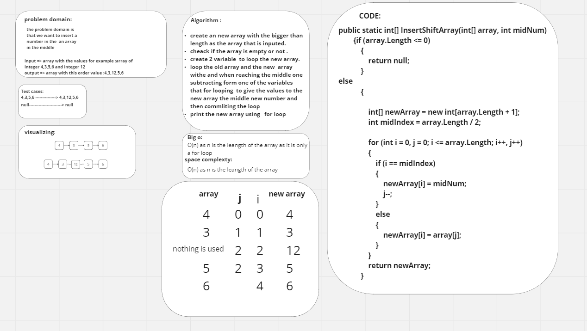
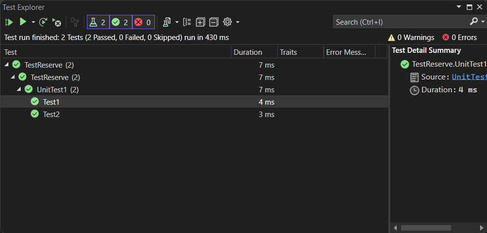
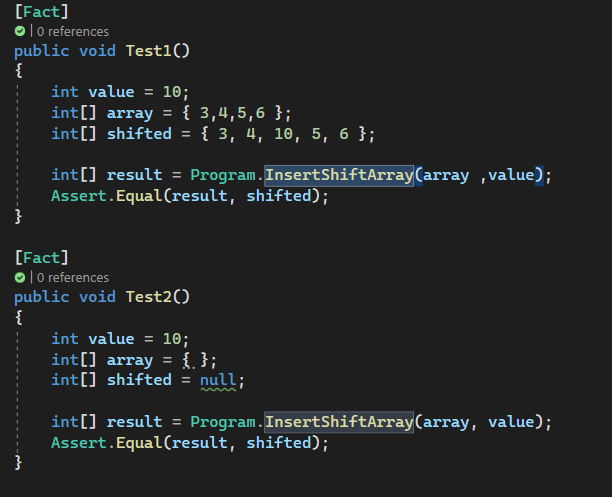

# challange code(1) :Insert Shift Array

this is a simple code that will take an a array and value and insert it into the middle of the array for  example if it takes {2,5,6,7} and the value you want to insert is
12 the output will be {2,5,12,6,7}
but if you gave it a null or an empty array it will return null .this code is wrote to achive a big o of O(n) i which the n is the length of the array
and the space comlexity is also the same.
this is the whiteboard for the problem :
 
 in this whiteboard you will find the steps of soliving this problem domain and also the code for this method also the test will be down below :
  
 
