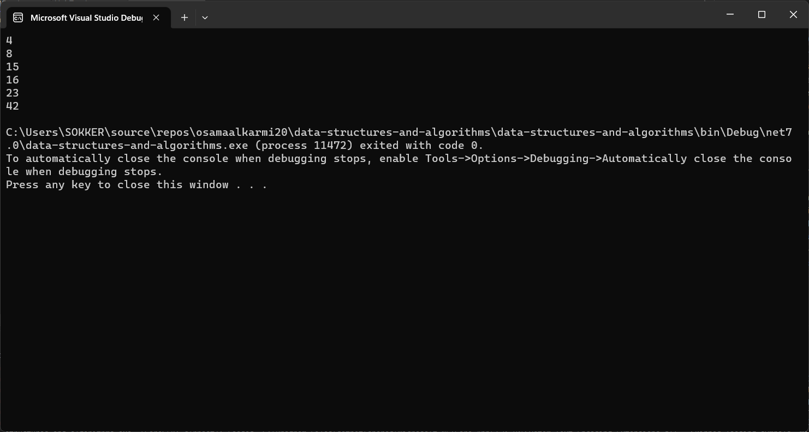
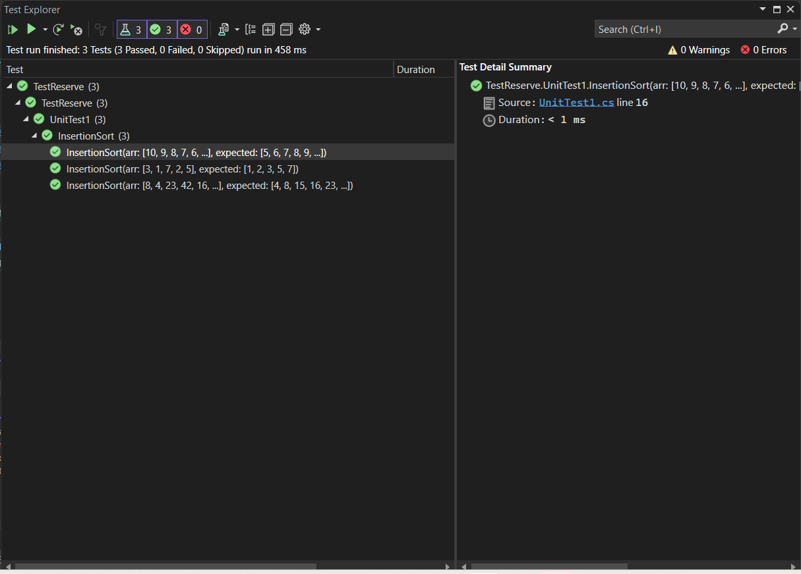

# challenge (26) : Insertion Sortion
## explanation
 the code demonstrates the Insertion Sort algorithm, which is an efficient sorting technique for small arrays or partially sorted arrays. It sorts the input array in ascending order by repeatedly inserting elements into their correct positions within the sorted portion of the array.




## Step by step explanation:
Initial array: 8, 4, 23, 42, 16, 15

Iteration 1:

i = 1, key = 4
Compare key (4) with arr[0] (8): 4 < 8, so no shift needed
Place key (4) at its correct position
Array: 4, 8, 23, 42, 16, 15
Iteration 2:

i = 2, key = 23
Compare key (23) with arr[1] (8): 23 > 8, so no shift needed before index 1
Place key (23) at its correct position
Array: 4, 8, 23, 42, 16, 15
Iteration 3:

i = 3, key = 42
Compare key (42) with arr[2] (23): 42 > 23, so no shift needed before index 2
Place key (42) at its correct position
Array: 4, 8, 23, 42, 16, 15
Iteration 4:

i = 4, key = 16
Compare key (16) with arr[3] (42): 16 < 42, so shift elements greater than 16 to the right
Array after shifting: 4, 8, 23, 42, 42, 15
Place key (16) at its correct position
Array: 4, 8, 16, 23, 42, 15
Iteration 5:

i = 5, key = 15
Compare key (15) with arr[4] (42): 15 < 42, so shift elements greater than 15 to the right
Array after shifting: 4, 8, 16, 23, 42, 42
Place key (15) at its correct position
Array: 4, 8, 15, 16, 23, 42
The loop ends since all elements have been processed.

Final sorted array: 4, 8, 15, 16, 23, 42

```c#
using System;
using System.Collections.Generic;

namespace data_structures_and_algorithms
{
    public class Program
    {
        static void Main(string[] args)
        {
           
            int[] arr = { 8, 4, 23, 42, 16, 15 };
            int[] arrsorted = InsertionSort(arr);
            for (int i = 0; i < arrsorted.Length; i++) {
                Console.WriteLine( arrsorted[i]);
            
            }
        }

        static public int[] InsertionSort(int[] arr)
        {
            int key, j;
            int n = arr.Length;

            for (int i = 1; i < n; i++)
            {
                key = arr[i];
                j = i - 1;

                while (j >= 0 && arr[j] > key)
                {
                    arr[j + 1] = arr[j];
                    j--;
                }

                arr[j + 1] = key;
            }

            return arr;
        }

    }
}
```

## Efficency:


### Time: O(n^2)
The basic operation of this algorithm is comparison. This will happen n * (n-1) number of times.concluding the algorithm to be n squared.
### Space: O(1)
No additional space is being created. This array is being sorted in place…keeping the space at constant O(1).

## test unit:


```c#
using data_structures_and_algorithms;
using static data_structures_and_algorithms.Program;


namespace TestReserve
{

    public class UnitTest1
    {

        [Theory]
        [InlineData(new[] { 8, 4, 23, 42, 16, 15 }, new[] { 4, 8, 15, 16, 23, 42 })]
        [InlineData(new[] { 3, 1, 7, 2, 5 }, new[] { 1, 2, 3, 5, 7 })]
        [InlineData(new[] { 10, 9, 8, 7, 6, 5 }, new[] { 5, 6, 7, 8, 9, 10 })]
        
        public void InsertionSort(int[] arr, int[] expected)
        {
            int[] result = Program.InsertionSort(arr);
            Assert.Equal(expected, result);
        }
    }
}
```
