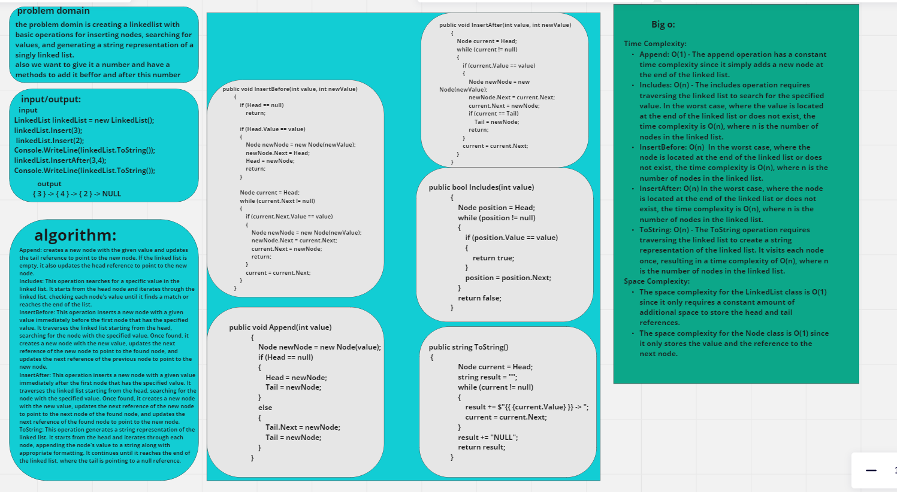

this is a simple way to make a single link list ,the code provides basic operations for inserting nodes, searching for values, inserting before or after a certain node and generating a string representation of a singly linked list. 
this is the whiteboard for the problem :

