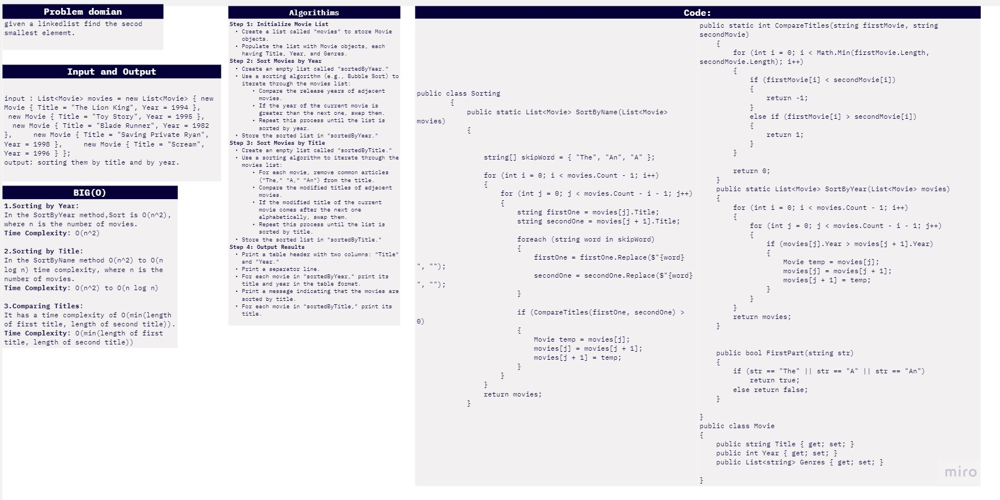
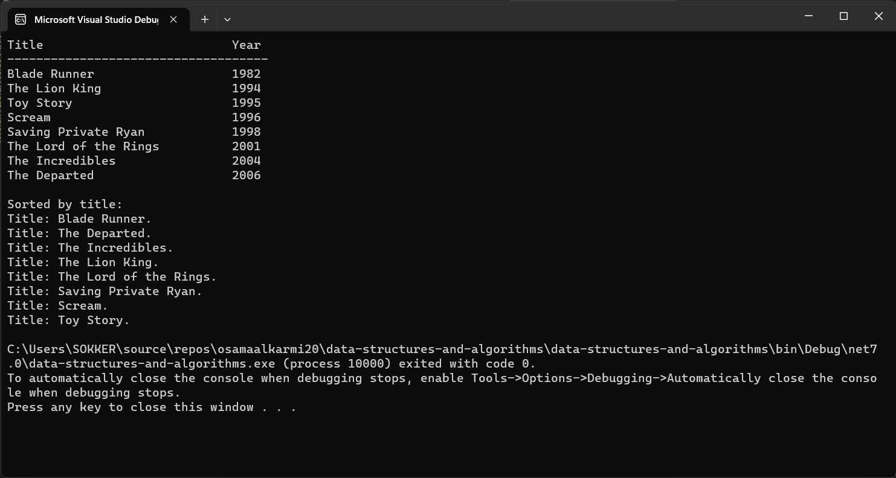
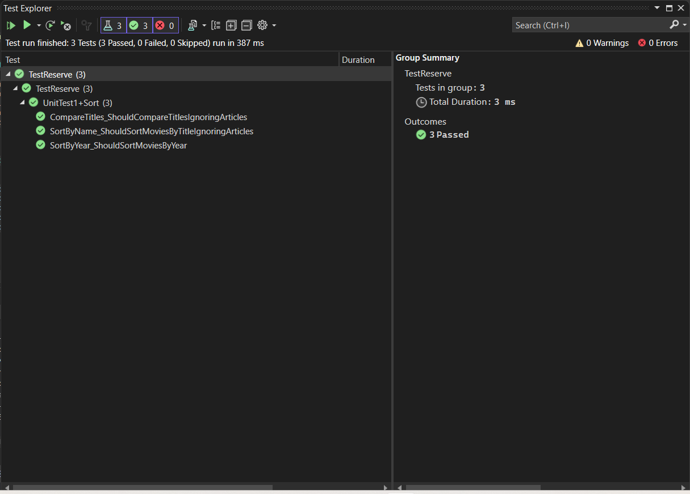

# challenge (28) :Movie Sort
## explanation
This code organizes movies, sorts them by title and year, and then outputs the sorted lists. It also contains a Movie class to define the movie structure and a Sorting class with methods for sorting movies. The CompareTitles method helps with title comparisons while ignoring common articles.
## whiteboard:



## walkthrough :

Walkthrough of the Code:

**List of Movies:**
This section initializes a list of Movie objects. Each movie has properties such as Title, Year, and Genres.

**Sorting and Output:**
Here, the Sorting class is used to sort the list of movies by year and title. The sorted lists are stored in `sortedByYear` and `sortedByTitle`, and then they are printed to the console.

**Output Formatting:**
This section prints the sorted movie lists to the console with proper formatting.

**Sorting Class:**
The Sorting class contains methods for sorting movies by name and year. It also has a helper method, `CompareTitles`, used for comparing movie titles.

**CompareTitles Method:**
The `CompareTitles` method compares two movie titles while ignoring common articles like "The," "A," and "An."

**SortByName Method:**
The `SortByName` method sorts a list of movies by their titles, using the `CompareTitles` method for comparisons.

**SortByYear Method:**
The `SortByYear` method sorts a list of movies by their release years.

**Movie Class:**
The `Movie` class defines the structure of a movie, including properties for Title, Year, and Genres.

**FirstPart Method:**
The `FirstPart` method checks if a given string is one of the common articles: "The," "A," or "An."


## code:


```c#
namespace data_structures_and_algorithms
{


    public class Program
    {
        static void Main()
        {


            List<Movie> movies = new List<Movie>
{
new Movie
{
    Title = "The Lion King",
    Year = 1994,
    Genres = new List<string> { "Animation", "Adventure", "Family" }
}
,
new Movie
{
    Title = "Toy Story",
    Year = 1995,
    Genres = new List<string> { "Animation", "Adventure", "Comedy" }
},

new Movie
{
    Title = "The Lord of the Rings",
    Year = 2001,
    Genres = new List<string> { "Fantasy", "Adventure", "Action" }
},

new Movie
{
    Title = "Blade Runner",
    Year = 1982,
    Genres = new List<string> { "Sci-Fi", "Action" }
},


new Movie
{
    Title = "Saving Private Ryan",
    Year = 1998,
    Genres = new List<string> { "Drama", "War" }
},

new Movie
{
    Title = "Scream",
    Year = 1996,
    Genres = new List<string> { "Horror", "Mystery" }
}
,
new Movie
{
    Title = "The Departed",
    Year = 2006,
    Genres = new List<string> { "Crime", "Thriller", "Drama" }
},

new Movie
{
    Title = "The Incredibles",
    Year = 2004,
    Genres = new List<string> { "Animation", "Action" }
}

};
            List<Movie> sortedByYear = Sorting.SortByYear(new List<Movie>(movies));
            List<Movie> sortedByTitle = Sorting.SortByName(new List<Movie>(movies));

            Console.WriteLine("{0,-30} {1}", "Title", "Year");
            Console.WriteLine(new string('-', 36));

            foreach (var movie in sortedByYear)
            {
                Console.WriteLine("{0,-30} {1}", movie.Title, movie.Year);
            }


            Console.WriteLine("\nSorted by title:");
            foreach (var movie in sortedByTitle)
            {
                Console.WriteLine($"Title: {movie.Title}.");


            }


        }

        public class Sorting
        {
            public static List<Movie> SortByName(List<Movie> movies)
            {


                string[] skipWord = { "The", "An", "A" };

                for (int i = 0; i < movies.Count - 1; i++)
                {
                    for (int j = 0; j < movies.Count - i - 1; j++)
                    {
                        string firstOne = movies[j].Title;
                        string secondOne = movies[j + 1].Title;

                        foreach (string word in skipWord)
                        {
                            firstOne = firstOne.Replace($"{word} ", "");
                            secondOne = secondOne.Replace($"{word} ", "");
                        }

                        if (CompareTitles(firstOne, secondOne) > 0)
                        {
                            Movie temp = movies[j];
                            movies[j] = movies[j + 1];
                            movies[j + 1] = temp;
                        }
                    }
                }
                return movies;
            }

            public static int CompareTitles(string firstMovie, string secondMovie)
            {
                for (int i = 0; i < Math.Min(firstMovie.Length, secondMovie.Length); i++)
                {
                    if (firstMovie[i] < secondMovie[i])
                    {
                        return -1;
                    }
                    else if (firstMovie[i] > secondMovie[i])
                    {
                        return 1;
                    }
                }

                return 0;
            }
            public static List<Movie> SortByYear(List<Movie> movies)
            {
                for (int i = 0; i < movies.Count - 1; i++)
                {
                    for (int j = 0; j < movies.Count - i - 1; j++)
                    {
                        if (movies[j].Year > movies[j + 1].Year)
                        {
                            Movie temp = movies[j];
                            movies[j] = movies[j + 1];
                            movies[j + 1] = temp;
                        }
                    }
                }
                return movies;
            }


            public bool FirstPart(string str)
            {
                if (str == "The" || str == "A" || str == "An")
                    return true;
                else return false;
            }

        }
        public class Movie
        {
            public string Title { get; set; }
            public int Year { get; set; }
            public List<string> Genres { get; set; }

        }
    }

}

```
## test unit:


```c#
using static data_structures_and_algorithms.Program;


namespace TestReserve
{

    public class UnitTest1
    {

        public class Sort
        {
            [Fact]
            public void SortByName_ShouldSortMoviesByTitleIgnoringArticles()
            {

                var movies = new List<Movie>
            {
                new Movie { Title = "The Lion King" },
                new Movie { Title = "Toy Story" },
                new Movie { Title = "Blade Runner" },
                new Movie { Title = "Saving Private Ryan" },
                new Movie { Title = "Scream" }
            };


                var sortedMovies = Sorting.SortByName(movies);

                Assert.Equal("Blade Runner", sortedMovies[0].Title);
                Assert.Equal("The Lion King", sortedMovies[1].Title);
                Assert.Equal("Saving Private Ryan", sortedMovies[2].Title);
                Assert.Equal("Scream", sortedMovies[3].Title);
                Assert.Equal("Toy Story", sortedMovies[4].Title);
            }

            [Fact]
            public void CompareTitles_ShouldCompareTitlesIgnoringArticles()
            {
                string title1 = "The Lion King";
                string title2 = "Toy Story";


                var result = Sorting.CompareTitles(title1, title2);


                Assert.True(result < 0);
            }

            [Fact]
            public void SortByYear_ShouldSortMoviesByYear()
            {

                var movies = new List<Movie>
            {
                new Movie { Title = "The Lion King", Year = 1994 },
                new Movie { Title = "Toy Story", Year = 1995 },
                new Movie { Title = "Blade Runner", Year = 1982 },
                new Movie { Title = "Saving Private Ryan", Year = 1998 },
                new Movie { Title = "Scream", Year = 1996 }
            };


                var sortedMovies = Sorting.SortByYear(movies);


                Assert.Equal(1982, sortedMovies[0].Year);
                Assert.Equal(1994, sortedMovies[1].Year);
                Assert.Equal(1995, sortedMovies[2].Year);
                Assert.Equal(1996, sortedMovies[3].Year);
                Assert.Equal(1998, sortedMovies[4].Year);
            }
        }
    }
}
```