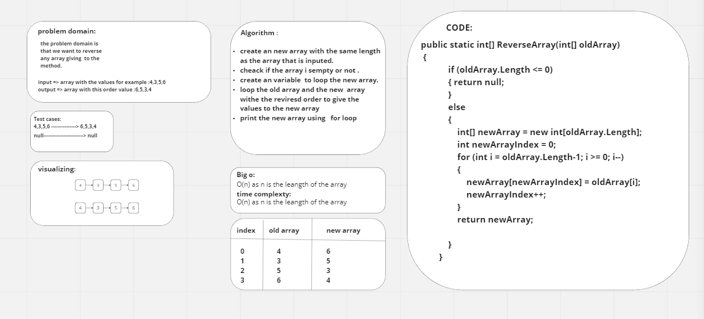
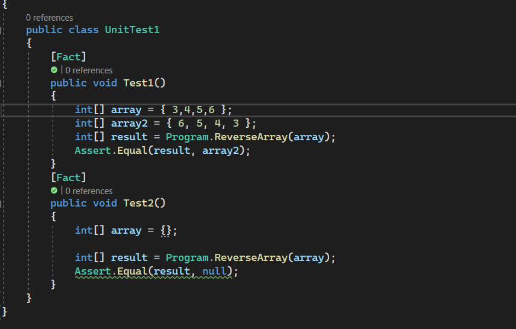

# challange code(1) :Revaerse Array

this is a simple code that will take an a array and reverses its order for example if it takes {2,7,5,6,7} the output will be {7,6,5,7,2}
but if you gave it a null or an empty array it will rutrn null .this code is wrote to achive a big o of O(n) i which the n is the leangth of the array
and the space comlexity is also the same.
this is the whiteboard for the problem :
 
 in this whiteboard you will find the steps of soliving this problem domain and also the code for this method also the test will be down below :
  
 
