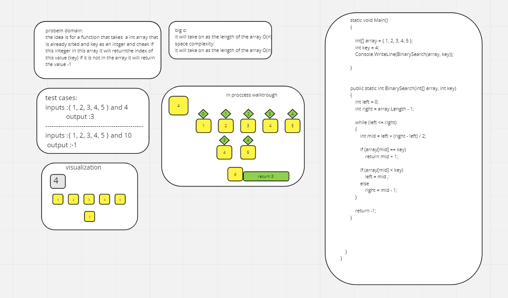
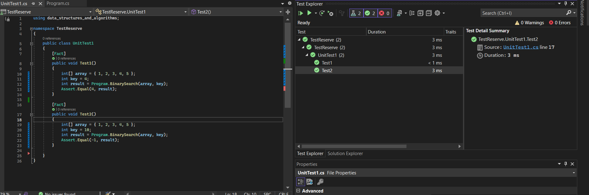

# challange code(3) :Binary Search
this is a simple code that will take an a array and key and checks if the key is in the array it will return the element with the key 
but if it is not in the array it will return -1 the array should be sorted .this code is wrote to achive a big o of O(n) i which the n is the leangth of the array
and the space comlexity is also the same.
this is the whiteboard for the problem :
 
 in this whiteboard you will find the steps of soliving this problem domain and also the code for this method also the test will be down below :
  
