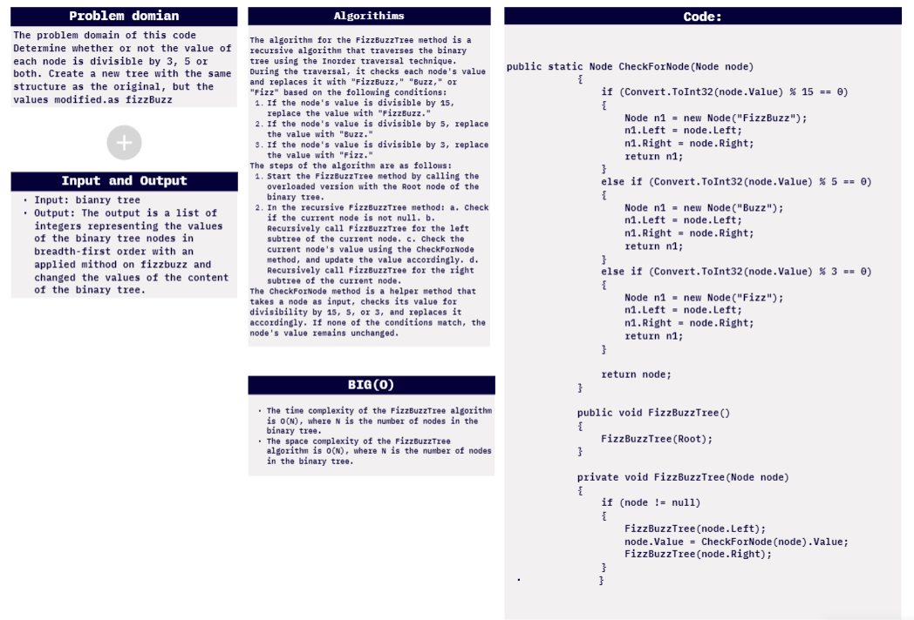
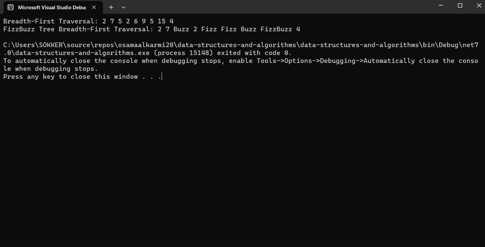
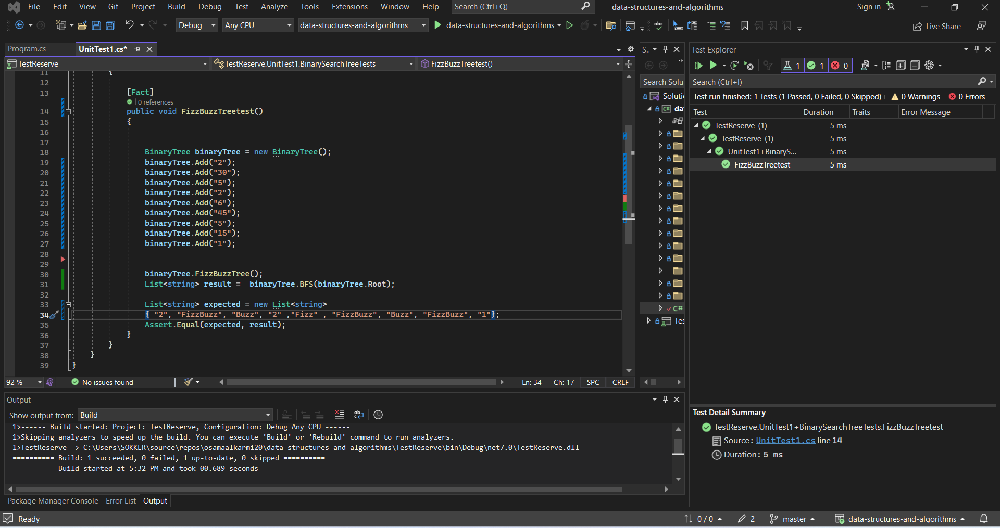

# challenge (18) : Fizz Buzz Tree
## explanation
The BFS method is a tree traversal technique that visits all the nodes of a binary tree in breadth-first order, i.e., level by level. It starts at the root node, explores all the nodes at the current level, and then moves to the next level. This is achieved by using a queue data structure to keep track of the nodes to be visited. BFS is useful for tasks such as finding the shortest path between two nodes or exploring all the nodes in a connected component of a graph.
after appling the BFS we will APPly the Fizz Buzz which is amithod that truns the values that are divadable by 3 to Buzz and the dividable by 5  to Fizz and the dividable by 5 and 3 to FizzBuzz.
## whitebourd:


## walkthrough :

Walkthrough of the Code:

The FizzBuzzTree method is declared inside the BinaryTree class and is responsible for modifying the nodes of the binary tree according to the FizzBuzz rules.

The FizzBuzzTree method is called from the Main method on the binaryTree object before printing the result.

Inside the FizzBuzzTree method, an overloaded version of the method is called with the Root of the binary tree. This helps start the recursive traversal from the root of the tree.

The recursive part of the FizzBuzzTree method is where the actual FizzBuzz replacements happen. It follows the Inorder traversal pattern, meaning it starts processing the left subtree, then the current node, and finally the right subtree.

When a node is visited, the CheckForNode method is called with the current node. This method checks if the node's value is divisible by 15, 5, or 3, and based on that, it replaces the node's value with "FizzBuzz," "Buzz," or "Fizz," respectively.

The left subtree is recursively processed first, so all the nodes in the left subtree are modified before moving to the current node.

The current node is then modified by calling the CheckForNode method.

Finally, the right subtree is processed in the same manner.

After the FizzBuzzTree method is executed, the binaryTree object is modified with the FizzBuzz replacements.

The InorderTraversal method is then called to print the modified tree in Inorder traversal order, which displays the FizzBuzz tree in the Breadth-First Traversal format.

The result is printed to the console, showing the original Breadth-First Traversal of the tree and the modified FizzBuzz Tree Breadth-First Traversal.
```c#
using System;
using System.Collections.Generic;

namespace data_structures_and_algorithms
{
    public class Program
    {
        static void Main(string[] args)
        {
            BinaryTree binaryTree = new BinaryTree();
            binaryTree.Add("2");
            binaryTree.Add("7");
            binaryTree.Add("5");
            binaryTree.Add("2");
            binaryTree.Add("6");
            binaryTree.Add("9");
            binaryTree.Add("5");
            binaryTree.Add("15");
            binaryTree.Add("4");

            Console.WriteLine("Breadth-First Traversal: " + string.Join(" ", binaryTree.BFS(binaryTree.Root)));

            binaryTree.FizzBuzzTree();

            Console.WriteLine("FizzBuzz Tree Breadth-First Traversal: " + string.Join(" ", binaryTree.BFS(binaryTree.Root)));
        }

        public class Node
        {
            public string Value { get; set; }
            public Node Left { get; set; }
            public Node Right { get; set; }

            public Node(string value)
            {
                Value = value;
                Left = null;
                Right = null;
            }
        }

        public class BinaryTree
        {
            public Node Root;

            public BinaryTree()
            {
                Root = null;
            }

            public static Node CheckForNode(Node node)
            {
                if (Convert.ToInt32(node.Value) % 15 == 0)
                {
                    Node n1 = new Node("FizzBuzz");
                    n1.Left = node.Left;
                    n1.Right = node.Right;
                    return n1;
                }
                else if (Convert.ToInt32(node.Value) % 5 == 0)
                {
                    Node n1 = new Node("Buzz");
                    n1.Left = node.Left;
                    n1.Right = node.Right;
                    return n1;
                }
                else if (Convert.ToInt32(node.Value) % 3 == 0)
                {
                    Node n1 = new Node("Fizz");
                    n1.Left = node.Left;
                    n1.Right = node.Right;
                    return n1;
                }

                return node;
            }

            public void FizzBuzzTree()
            {
                FizzBuzzTree(Root);
            }

            private void FizzBuzzTree(Node node)
            {
                if (node != null)
                {
                    FizzBuzzTree(node.Left);
                    node.Value = CheckForNode(node).Value;
                    FizzBuzzTree(node.Right);
                }
            }

            public List<string> InorderTraversal()
            {
                List<string> result = new List<string>();
                InorderTraversal(Root, result);
                return result;
            }

            private void InorderTraversal(Node node, List<string> result)
            {
                if (node != null)
                {
                    InorderTraversal(node.Left, result);
                    result.Add(node.Value);
                    InorderTraversal(node.Right, result);
                }
            }

            public List<string> BFS(Node root)
            {
                Queue<Node> queue = new Queue<Node>();
                List<string> results = new List<string>();
                if (root == null) return results;
                queue.Enqueue(root);
                while (queue.Count != 0)
                {
                    Node newNode = queue.Dequeue();
                    results.Add(newNode.Value);
                    if (newNode.Left != null)
                    {
                        queue.Enqueue(newNode.Left);
                    }
                    if (newNode.Right != null)
                    {
                        queue.Enqueue(newNode.Right);
                    }
                }
                return results;
            }

            public void Add(string value)
            {
                Root = AddRecursive(Root, value);
            }

            private Node AddRecursive(Node current, string value)
            {
                if (current == null)
                {
                    return new Node(value);
                }

                if (current.Left == null)
                {
                    current.Left = new Node(value);
                }
                else if (current.Right == null)
                {
                    current.Right = new Node(value);
                }
                else
                {
                    current.Left = AddRecursive(current.Left, value);
                }

                return current;
            }
        }
    }
}
```
## test unit:


```c#
using static data_structures_and_algorithms.Program;


namespace TestReserve
{

    public class UnitTest1
    {

        public class BinarySearchTreeTests
        {

            [Fact]
            public void FizzBuzzTreetest()
            {


                BinaryTree binaryTree = new BinaryTree();
                binaryTree.Add("2");
                binaryTree.Add("30");
                binaryTree.Add("5");
                binaryTree.Add("2");
                binaryTree.Add("6");
                binaryTree.Add("45");
                binaryTree.Add("5");
                binaryTree.Add("15");
                binaryTree.Add("1");


                binaryTree.FizzBuzzTree();
                List<string> result =  binaryTree.BFS(binaryTree.Root);

                List<string> expected = new List<string> 
                { "2", "FizzBuzz", "Buzz", "2" ,"Fizz" , "FizzBuzz", "Buzz", "FizzBuzz", "1"};
                Assert.Equal(expected, result);
            }
        }
    }
}
```
