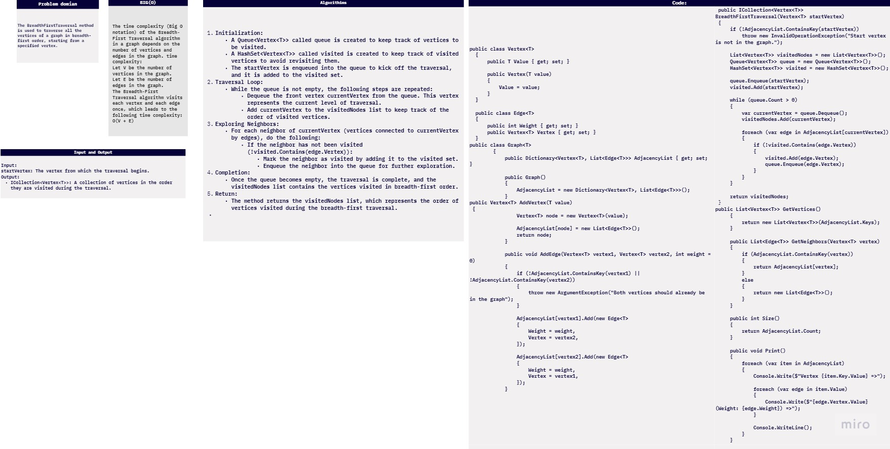
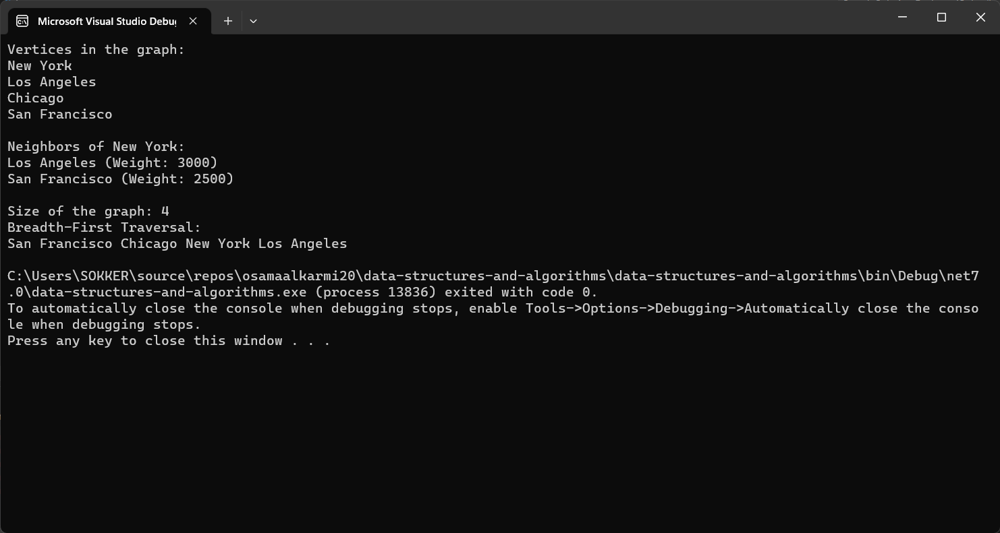
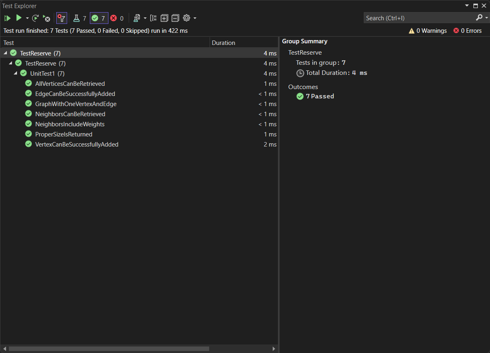

# Breadth-First Traversal in a Graph

In the provided C# program, there is an implementation of the Breadth-First Traversal algorithm within a generic graph data structure. In this document, we will explain the implementation of the `BreadthFirstTraversal` method and provide a step-by-step explanation of how this method works.




## Breadth-First Traversal Method


The `BreadthFirstTraversal` method is used to traverse all the vertices of a graph in breadth-first order, starting from a specified vertex. It utilizes a queue data structure to maintain the order in which vertices are visited. Here is the method's signature:

```csharp
public ICollection<Vertex<T>> BreadthFirstTraversal(Vertex<T> startVertex)
```

**Parameters:**
- `startVertex`: The vertex from which the traversal begins.

**Return Value:**
- `ICollection<Vertex<T>>`: A collection of vertices in the order they are visited during the traversal.

## How Breadth-First Traversal Works

The Breadth-First Traversal algorithm explores the graph level by level, visiting all vertices at the current level before moving on to the next level. Here's a step-by-step explanation of how the method works:

1. **Initialization:**
   - A `Queue<Vertex<T>>` called `queue` is created to keep track of vertices to be visited.
   - A `HashSet<Vertex<T>>` called `visited` is created to keep track of visited vertices to avoid revisiting them.
   - The `startVertex` is enqueued into the `queue` to kick off the traversal, and it is added to the `visited` set.

2. **Traversal Loop:**
   - While the `queue` is not empty, the following steps are repeated:
     - Dequeue the front vertex `currentVertex` from the `queue`. This vertex represents the current level of traversal.
     - Add `currentVertex` to the `visitedNodes` list to keep track of the order of visited vertices.

3. **Exploring Neighbors:**
   - For each neighbor of `currentVertex` (vertices connected to `currentVertex` by edges), do the following:
     - If the neighbor has not been visited (`!visited.Contains(edge.Vertex)`):
       - Mark the neighbor as visited by adding it to the `visited` set.
       - Enqueue the neighbor into the `queue` for further exploration.

4. **Completion:**
   - Once the `queue` becomes empty, the traversal is complete, and the `visitedNodes` list contains the vertices visited in breadth-first order.

5. **Return:**
   - The method returns the `visitedNodes` list, which represents the order of vertices visited during the breadth-first traversal.


## Example Usage in the Provided Program

In the provided program, the `BreadthFirstTraversal` method is demonstrated with the following line of code:

```csharp
var bfsOrder = graph.BreadthFirstTraversal(d);
```

This line starts the traversal from the vertex "San Francisco" (`d`) and stores the order of visited vertices in the `bfsOrder` collection. The program then prints this order to the console, allowing you to see how breadth-first traversal works for the given graph.

This method is a fundamental algorithm for exploring and understanding the structure of a graph, and it is often used in various graph-related applications such as finding the shortest path between two vertices.



## Code:

```csharp
using System;
using System.Collections.Generic;

namespace data_structures_and_algorithms
{
    public class Program
    {
        static void Main(string[] args)
        {
            Graph<string> graph = new Graph<string>();

            Vertex<string> a = graph.AddVertex("New York");
            Vertex<string> b = graph.AddVertex("Los Angeles");
            Vertex<string> c = graph.AddVertex("Chicago");
            Vertex<string> d = graph.AddVertex("San Francisco");

            graph.AddEdge(a, b, 3000);
            graph.AddEdge(b, c, 2000);
            graph.AddEdge(c, d, 1800);
            graph.AddEdge(d, a, 2500);

            Console.WriteLine("Vertices in the graph:");
            foreach (var vertex in graph.GetVertices())
            {
                Console.WriteLine(vertex.Value);
            }

            Console.WriteLine("\nNeighbors of New York:");
            var newYorkNeighbors = graph.GetNeighbors(a);
            foreach (var edge in newYorkNeighbors)
            {
                Console.WriteLine($"{edge.Vertex.Value} (Weight: {edge.Weight})");
            }

            Console.WriteLine("\nSize of the graph: " + graph.Size());


            Console.WriteLine("Breadth-First Traversal:");
            var bfsOrder = graph.BreadthFirstTraversal(d);
            foreach (var vertex in bfsOrder)
            {
                Console.Write($"{vertex.Value} ");
            }
            Console.WriteLine();

        }


        public class Vertex<T>
        {
            public T Value { get; set; }

            public Vertex(T value)
            {
                Value = value;
            }
        }

        public class Edge<T>
        {
            public int Weight { get; set; }
            public Vertex<T> Vertex { get; set; }
        }

        public class Graph<T>
        {
            public Dictionary<Vertex<T>, List<Edge<T>>> AdjacencyList { get; set; }
            public ICollection<Vertex<T>> BreadthFirstTraversal(Vertex<T> startVertex)
            {
                if (!AdjacencyList.ContainsKey(startVertex))
                    throw new InvalidOperationException("Start vertex is not in the graph.");

                List<Vertex<T>> visitedNodes = new List<Vertex<T>>();
                Queue<Vertex<T>> queue = new Queue<Vertex<T>>();
                HashSet<Vertex<T>> visited = new HashSet<Vertex<T>>();

                queue.Enqueue(startVertex);
                visited.Add(startVertex);

                while (queue.Count > 0)
                {
                    var currentVertex = queue.Dequeue();
                    visitedNodes.Add(currentVertex);

                    foreach (var edge in AdjacencyList[currentVertex])
                    {
                        if (!visited.Contains(edge.Vertex))
                        {
                            visited.Add(edge.Vertex);
                            queue.Enqueue(edge.Vertex);
                        }
                    }
                }

                return visitedNodes;
            }
            public Graph()
            {
                AdjacencyList = new Dictionary<Vertex<T>, List<Edge<T>>>();
            }

            public Vertex<T> AddVertex(T value)
            {
                Vertex<T> node = new Vertex<T>(value);

                AdjacencyList[node] = new List<Edge<T>>();
                return node;
            }

            public void AddEdge(Vertex<T> vertex1, Vertex<T> vertex2, int weight = 0)
            {
                if (!AdjacencyList.ContainsKey(vertex1) || !AdjacencyList.ContainsKey(vertex2))
                {
                    throw new ArgumentException("Both vertices should already be in the graph");
                }

                AdjacencyList[vertex1].Add(new Edge<T>
                {
                    Weight = weight,
                    Vertex = vertex2,
                });

                AdjacencyList[vertex2].Add(new Edge<T>
                {
                    Weight = weight,
                    Vertex = vertex1,
                });
            }

            public List<Vertex<T>> GetVertices()
            {
                return new List<Vertex<T>>(AdjacencyList.Keys);
            }

            public List<Edge<T>> GetNeighbors(Vertex<T> vertex)
            {
                if (AdjacencyList.ContainsKey(vertex))
                {
                    return AdjacencyList[vertex];
                }
                else
                {
                    return new List<Edge<T>>();
                }
            }

            public int Size()
            {
                return AdjacencyList.Count;
            }

            public void Print()
            {
                foreach (var item in AdjacencyList)
                {
                    Console.Write($"Vertex {item.Key.Value} =>");

                    foreach (var edge in item.Value)
                    {
                        Console.Write($"{edge.Vertex.Value} (Weight: {edge.Weight}) =>");
                    }

                    Console.WriteLine();
                }
            }
        }
    }
}

```
## test:

```csharp
using data_structures_and_algorithms;
using static data_structures_and_algorithms.Program;

namespace TestReserve
{
    public class UnitTest1
    {
      

        [Fact]
        public void AddEdge_ShouldAddEdgeBetweenVertices()
        {
            var graph = new Graph<string>();
            var vertex1 = graph.AddVertex("A");
            var vertex2 = graph.AddVertex("B");

            graph.AddEdge(vertex1, vertex2);

            var neighborsOfVertex1 = graph.GetNeighbors(vertex1);
            var neighborsOfVertex2 = graph.GetNeighbors(vertex2);

            Assert.Single(neighborsOfVertex1);
            Assert.Single(neighborsOfVertex2);
            Assert.Equal(vertex2.Value, neighborsOfVertex1.First().Vertex.Value);
            Assert.Equal(vertex1.Value, neighborsOfVertex2.First().Vertex.Value);
        }

        [Fact]
        public void GetVertices_ShouldReturnAllVerticesInGraph()
        {
            var graph = new Graph<char>();
            var vertex1 = graph.AddVertex('A');
            var vertex2 = graph.AddVertex('B');
            var vertex3 = graph.AddVertex('C');

            var vertices = graph.GetVertices();

            Assert.Equal(3, vertices.Count);
            Assert.Contains(vertex1, vertices);
            Assert.Contains(vertex2, vertices);
            Assert.Contains(vertex3, vertices);
        }

        [Fact]
        public void GetNeighbors_ShouldReturnNeighborsOfVertex()
        {
            var graph = new Graph<int>();
            var vertex1 = graph.AddVertex(1);
            var vertex2 = graph.AddVertex(2);
            var vertex3 = graph.AddVertex(3);
            graph.AddEdge(vertex1, vertex2, 10);
            graph.AddEdge(vertex1, vertex3, 20);

            var neighborsOfVertex1 = graph.GetNeighbors(vertex1);

            Assert.Equal(2, neighborsOfVertex1.Count);
            Assert.Contains(neighborsOfVertex1, edge => edge.Vertex.Value == vertex2.Value && edge.Weight == 10);
            Assert.Contains(neighborsOfVertex1, edge => edge.Vertex.Value == vertex3.Value && edge.Weight == 20);
        }
        ///// breadth first
        [Fact]
        public void BreadthFirstTraversalShouldTraverseInCorrectOrder()
        {
            var graph = new Graph<string>();
            var vertexA = graph.AddVertex("Pandora");
            var vertexB = graph.AddVertex("Arendelle");
            var vertexC = graph.AddVertex("Metroville");
            var vertexD = graph.AddVertex("Monstroplolis");
            var vertexE = graph.AddVertex("Narnia");
            var vertexF = graph.AddVertex("Naboo");

            graph.AddEdge(vertexA, vertexB);
            graph.AddEdge(vertexB, vertexC);
            graph.AddEdge(vertexC, vertexD);
            graph.AddEdge(vertexD, vertexE);
            graph.AddEdge(vertexE, vertexF);

            var result = graph.BreadthFirstTraversal(vertexA);

            Assert.Collection(result,
                vertex => Assert.Equal("Pandora", vertex.Value),
                vertex => Assert.Equal("Arendelle", vertex.Value),
                vertex => Assert.Equal("Metroville", vertex.Value),
                vertex => Assert.Equal("Monstroplolis", vertex.Value),
                vertex => Assert.Equal("Narnia", vertex.Value),
                vertex => Assert.Equal("Naboo", vertex.Value)
            );
        }

        [Fact]
        public void BreadthFirstTraversalInvalidStartVertexShouldThrowException()
        {
            var graph = new Graph<string>();
            var invalidVertex = new Vertex<string>("InvalidVertex");

            var exception = Assert.Throws<InvalidOperationException>(() => graph.BreadthFirstTraversal(invalidVertex));
            Assert.Equal("Start vertex is not in the graph.", exception.Message);
        }
    }
}

```