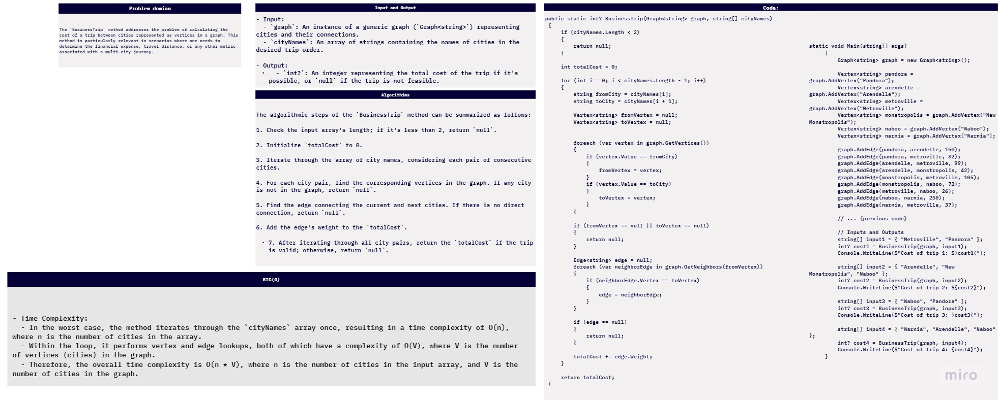

## Document: BusinessTrip Method

### 1. Problem Domain

The `BusinessTrip` method addresses the problem of calculating the cost of a trip between cities represented as vertices in a graph. This method is particularly relevant in scenarios where one needs to determine the financial expense, travel distance, or any other metric associated with a multi-city journey.

### 2. Input and Output

- **Input**: 
  - `graph`: An instance of a generic graph (`Graph<string>`) representing cities and their connections. 
  - `cityNames`: An array of strings containing the names of cities in the desired trip order.

- **Output**: 
  - `int?`: An integer representing the total cost of the trip if it's possible, or `null` if the trip is not feasible.
 ### run 
  
  ### test
   
### 3. How It Works - Step by Step

The `BusinessTrip` method operates as follows:

#### Input Validation

1. The method first checks if the input array `cityNames` contains at least two city names. A trip with fewer than two cities is not meaningful, so if the length is less than 2, it returns `null`.

#### Initialization

2. It initializes an integer variable `totalCost` to keep track of the cumulative cost of the trip.

#### Iterating Over Cities

3. The method iterates through the `cityNames` array, considering each consecutive pair of cities. For each pair, it performs the following steps:

#### Finding Vertices

4. It searches for the corresponding vertex objects in the provided graph based on the city names, initializing `fromVertex` and `toVertex` variables to `null`.

5. If a city name is not found in the graph (either `fromVertex` or `toVertex` remains `null`), it indicates that one of the cities is not in the graph, and the method returns `null`.

#### Finding Edges

6. It looks for an edge (connection) between the two vertices representing the current and next cities, initializing an `edge` variable to `null`.

7. If there is no direct connection between the cities (i.e., `edge` remains `null`), it indicates that the trip is not feasible, and the method returns `null`.

#### Calculating Cost

8. If a valid edge is found, it adds the weight (distance, expense, or any applicable metric) associated with the edge to the `totalCost`.

#### Returning Result

9. After iterating through all city pairs, the method returns the `totalCost` as an integer if the trip is valid.

10. If the trip is not possible due to missing cities or a lack of direct connections, it returns `null`.

### 4. Algorithm

The algorithmic steps of the `BusinessTrip` method can be summarized as follows:

1. Check the input array's length; if it's less than 2, return `null`.

2. Initialize `totalCost` to 0.

3. Iterate through the array of city names, considering each pair of consecutive cities.

4. For each city pair, find the corresponding vertices in the graph. If any city is not in the graph, return `null`.

5. Find the edge connecting the current and next cities. If there is no direct connection, return `null`.

6. Add the edge's weight to the `totalCost`.

7. After iterating through all city pairs, return the `totalCost` if the trip is valid; otherwise, return `null`.

### 5. Big O Complexity

The Big O complexity of the `BusinessTrip` method can be analyzed as follows:

- **Time Complexity**: 
  - In the worst case, the method iterates through the `cityNames` array once, resulting in a time complexity of O(n), where n is the number of cities in the array.
  - Within the loop, it performs vertex and edge lookups, both of which have a complexity of O(V), where V is the number of vertices (cities) in the graph. 
  - Therefore, the overall time complexity is O(n * V), where n is the number of cities in the input array, and V is the number of cities in the graph.

- **Space Complexity**: 
  - The space complexity is primarily determined by the storage of vertex and edge objects as well as the `totalCost` variable. These are constant space requirements and do not depend on the input size, resulting in a space complexity of O(1).

### 6. Conclusion

The `BusinessTrip` method is a versatile tool for calculating the cost of traveling between cities within a graph. It provides a reliable solution for determining the total cost of a trip while handling various scenarios, including invalid inputs, missing cities, and disconnected routes. Understanding its functionality and algorithmic complexity is essential for effectively utilizing this method in graph-based applications.