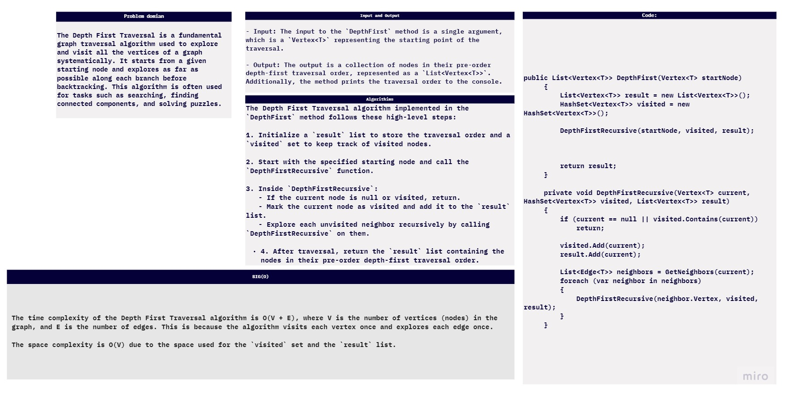
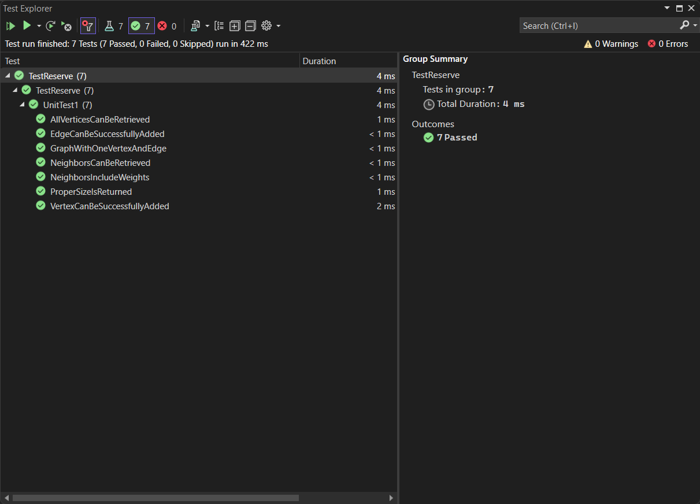


## Depth First Traversal Method Documentation

### Problem Domain
The Depth First Traversal is a fundamental graph traversal algorithm used to explore and visit all the vertices of a graph systematically. It starts from a given starting node and explores as far as possible along each branch before backtracking. This algorithm is often used for tasks such as searching, finding connected components, and solving puzzles.

### Step-by-Step Walkthrough
The `DepthFirst` method is used to perform a Depth First Traversal of a graph starting from a specified node. Here's a step-by-step explanation of how the method works:

1. **Input**: The method takes one argument, which is a `Vertex<T>` representing the starting point of the traversal.

2. **Initialization**: Inside the method, a `List<Vertex<T>> result` is initialized to store the nodes in their pre-order depth-first traversal order. A `HashSet<Vertex<T>> visited` is used to keep track of visited nodes to avoid revisiting them.

3. **Depth-First Recursive Function**: The core of the algorithm is a recursive function called `DepthFirstRecursive`. This function takes the current node, the `visited` set, and the `result` list as parameters.

4. **Base Case**: If the current node is null or has already been visited, the function returns immediately.

5. **Mark Current Node as Visited**: The current node is added to the `visited` set and appended to the `result` list.

6. **Explore Neighbors**: The method retrieves the neighbors of the current node using the `GetNeighbors` function. For each unvisited neighbor, the `DepthFirstRecursive` function is called recursively.

7. **Printing**: The `DepthFirst` method also prints the collected nodes in the pre-order depth-first traversal order as specified.

8. **Output**: The method returns the `result` list containing the nodes in their traversal order.
## run:

## test:

### Big O Complexity
The time complexity of the Depth First Traversal algorithm is O(V + E), where V is the number of vertices (nodes) in the graph, and E is the number of edges. This is because the algorithm visits each vertex once and explores each edge once.

The space complexity is O(V) due to the space used for the `visited` set and the `result` list.

### Input and Output
- **Input**: The input to the `DepthFirst` method is a single argument, which is a `Vertex<T>` representing the starting point of the traversal.

- **Output**: The output is a collection of nodes in their pre-order depth-first traversal order, represented as a `List<Vertex<T>>`. Additionally, the method prints the traversal order to the console.

### Algorithm
The Depth First Traversal algorithm implemented in the `DepthFirst` method follows these high-level steps:

1. Initialize a `result` list to store the traversal order and a `visited` set to keep track of visited nodes.

2. Start with the specified starting node and call the `DepthFirstRecursive` function.

3. Inside `DepthFirstRecursive`:
   - If the current node is null or visited, return.
   - Mark the current node as visited and add it to the `result` list.
   - Explore each unvisited neighbor recursively by calling `DepthFirstRecursive` on them.

4. After traversal, return the `result` list containing the nodes in their pre-order depth-first traversal order.

