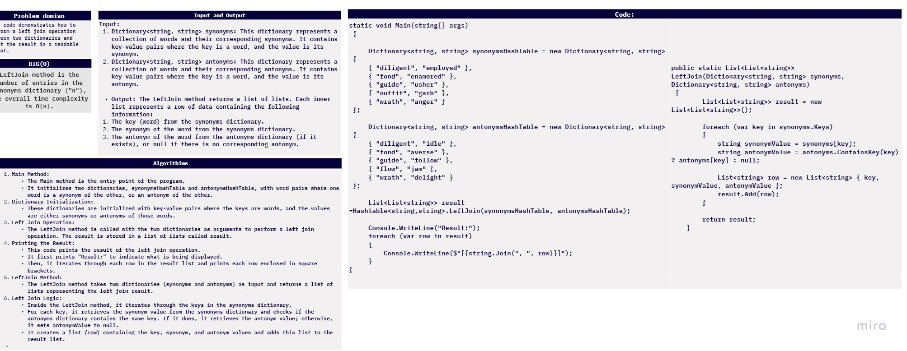
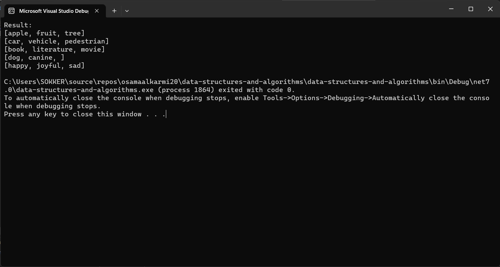
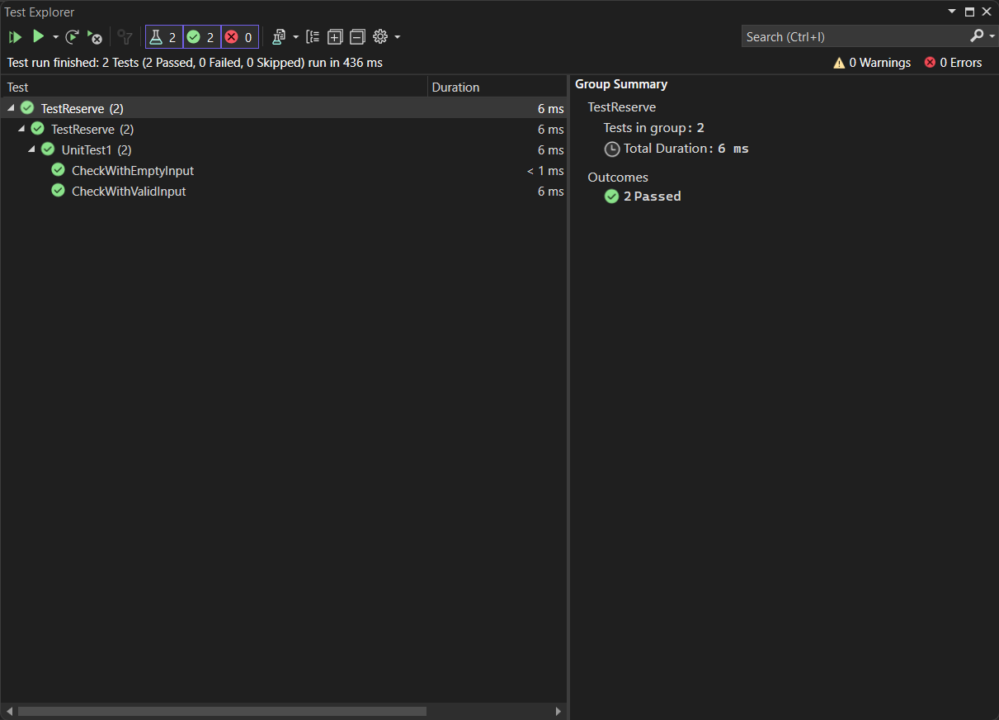

# challenge (33) : Hashmap leftjoin
## explanation
 this code demonstrates how to perform a left join operation between two dictionaries and print the result in a readable format.

 

## Step by step explanation:

1. **Main Method**:
   - The `Main` method is the entry point of the program.
   - It initializes two dictionaries, `synonymsHashTable` and `antonymsHashTable`, with word pairs where one word is a synonym of the other, or an antonym of the other.

2. **Dictionary Initialization**:
   - These dictionaries are initialized with key-value pairs where the keys are words, and the values are either synonyms or antonyms of those words.

3. **Left Join Operation**:
   - The `LeftJoin` method is called with the two dictionaries as arguments to perform a left join operation. The result is stored in a list of lists called `result`.

4. **Printing the Result**:
   - This code prints the result of the left join operation.
   - It first prints "Result:" to indicate what is being displayed.
   - Then, it iterates through each row in the `result` list and prints each row enclosed in square brackets.

5. **LeftJoin Method**:
   - The `LeftJoin` method takes two dictionaries (`synonyms` and `antonyms`) as input and returns a list of lists representing the left join result.

6. **Left Join Logic**:
   - Inside the `LeftJoin` method, it iterates through the keys in the `synonyms` dictionary.
   - For each key, it retrieves the synonym value from the `synonyms` dictionary and checks if the `antonyms` dictionary contains the same key. If it does, it retrieves the antonym value; otherwise, it sets `antonymValue` to `null`.
   - It creates a list (`row`) containing the key, synonym, and antonym values and adds this list to the `result` list.



## code:
```c#
using System;
using System.Collections.Generic;

namespace data_structures_and_algorithms
{
    public class Program
    {
        public static void Main(string[] args)
        {
            Dictionary<string, string> synonymsHashTable = new Dictionary<string, string>
{
    { "apple", "fruit" },
    { "car", "vehicle" },
    { "book", "literature" },
    { "dog", "canine" },
    { "happy", "joyful" }
};

            Dictionary<string, string> antonymsHashTable = new Dictionary<string, string>
{
    { "apple", "tree" },
    { "car", "pedestrian" },
    { "book", "movie" },
    { "flower", "thorn" },
    { "happy", "sad" }
};

            // Perform left join
            List<List<string>> result = LeftJoin(synonymsHashTable, antonymsHashTable);

            // Print the result
            Console.WriteLine("Result:");
            foreach (var row in result)
            {
                Console.WriteLine($"[{string.Join(", ", row)}]");
            }
        }


        public static List<List<string>> LeftJoin(Dictionary<string, string> synonyms, Dictionary<string, string> antonyms)
        {
            List<List<string>> result = new List<List<string>>();

            foreach (var key in synonyms.Keys)
            {
                string synonymValue = synonyms[key];
                string antonymValue = antonyms.ContainsKey(key) ? antonyms[key] : null;

                List<string> row = new List<string> { key, synonymValue, antonymValue };
                result.Add(row);
            }

            return result;
        }
    }
}
```


## test:
```c#

using data_structures_and_algorithms;
using static data_structures_and_algorithms.Program;

namespace TestReserve
{

    public class UnitTest1
    {


        [Fact]
        public void CheckWithValidInput()
        {
            Dictionary<string, string> synonymsHashTable = new Dictionary<string, string>
        {
            { "diligent", "employed" },
            { "fond", "enamored" },
            { "guide", "usher" },
            { "outfit", "garb" },
            { "wrath", "anger" }
        };

            Dictionary<string, string> antonymsHashTable = new Dictionary<string, string>
        {
            { "diligent", "idle" },
            { "fond", "averse" },
            { "guide", "follow" },
            { "flow", "jam" },
            { "wrath", "delight" }
        };

            List<List<string>> expected = new List<List<string>>
        {
            new List<string> { "diligent", "employed", "idle" },
            new List<string> { "fond", "enamored", "averse" },
            new List<string> { "guide", "usher", "follow" },
            new List<string> { "outfit", "garb", null },
            new List<string> { "wrath", "anger", "delight" }
        };

            List<List<string>> result = LeftJoin(synonymsHashTable, antonymsHashTable);

            Assert.Equal(expected, result);
        }

        [Fact]
        public void CheckWithEmptyInput()
        {
            Dictionary<string, string> synonymsHashTable = new Dictionary<string, string>();
            Dictionary<string, string> antonymsHashTable = new Dictionary<string, string>();

            List<List<string>> expected = new List<List<string>>();

            List<List<string>> result = LeftJoin(synonymsHashTable, antonymsHashTable);

            Assert.Equal(expected, result);
        }

        public List<List<string>> LeftJoin(Dictionary<string, string> synonyms, Dictionary<string, string> antonyms)
        {
            List<List<string>> result = new List<List<string>>();

            foreach (var key in synonyms.Keys)
            {
                string synonymValue = synonyms[key];
                string antonymValue = antonyms.ContainsKey(key) ? antonyms[key] : null;

                List<string> row = new List<string> { key, synonymValue, antonymValue };
                result.Add(row);
            }

            return result;
        }
    }
}
```
