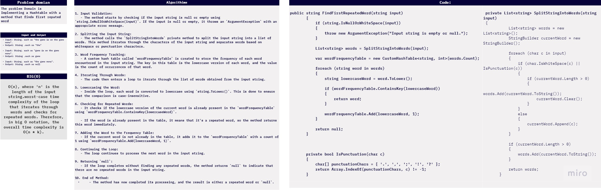
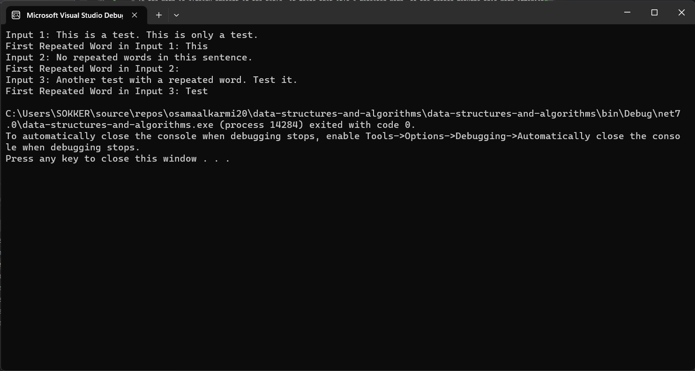
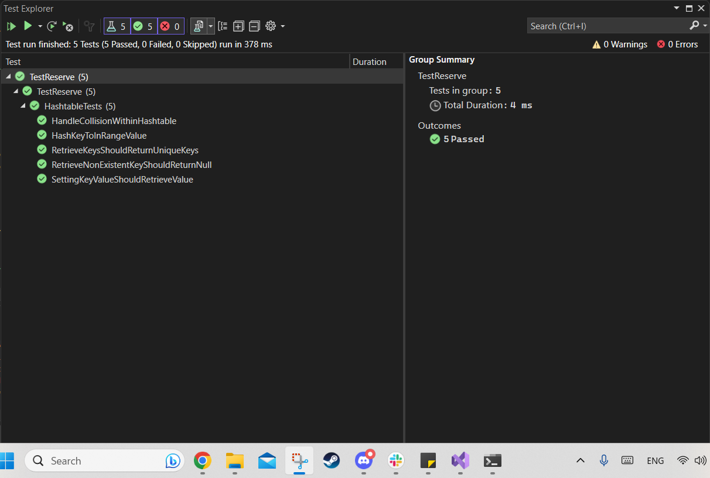

# challenge (31) : Hash Tables :Mapping Repeating Words 
## explanation
 the code demonstrates the Implemintationn for the Hash Tables And if you give it an string(sentance) it will find the the first word that is repeated  .


 

## Step by step explanation:
1. **Input Validation:**
   - The method starts by checking if the input string is null or empty using `string.IsNullOrWhiteSpace(input)`. If the input is null or empty, it throws an `ArgumentException` with an appropriate error message.

2. **Splitting the Input String:**
   - The method calls the `SplitStringIntoWords` private method to split the input string into a list of words. This method iterates through the characters of the input string and separates words based on whitespace or punctuation characters.

3. **Word Frequency Tracking:**
   - A custom hash table called `wordFrequencyTable` is created to store the frequency of each word encountered in the input string. The key in this table is the lowercase version of each word, and the value is the count of occurrences of that word.

4. **Iterating Through Words:**
   - The code then enters a loop to iterate through the list of words obtained from the input string.

5. **Lowercasing the Word:**
   - Inside the loop, each word is converted to lowercase using `string.ToLower()`. This is done to ensure that the comparison is case-insensitive.

6. **Checking for Repeated Words:**
   - It checks if the lowercase version of the current word is already present in the `wordFrequencyTable` using `wordFrequencyTable.ContainsKey(lowercaseWord)`.
   
   - If the word is already present in the table, it means that it's a repeated word, so the method returns this word immediately.

7. **Adding the Word to the Frequency Table:**
   - If the current word is not already in the table, it adds it to the `wordFrequencyTable` with a count of 1 using `wordFrequencyTable.Add(lowercaseWord, 1)`.

8. **Continuing the Loop:**
   - The loop continues to process the next word in the input string.

9. **Returning `null`:**
   - If the loop completes without finding any repeated words, the method returns `null` to indicate that there are no repeated words in the input string.

10. **End of Method:**
    - The method has now completed its processing, and the result is either a repeated word or `null`.


## code:
```c#
using System;
using System.Collections.Generic;
using System.Text;

namespace data_structures_and_algorithms
{
    class Program
    {
        static void Main(string[] args)
        {
            CustomHashTable<string, int> customHashTable = new CustomHashTable<string, int>(100);

            string input1 = "This is a test. This is only a test.";
            string input2 = "No repeated words in this sentence.";
            string input3 = "Another test with a repeated word. Test it.";

            string repeatedWord1 = customHashTable.FindFirstRepeatedWord(input1);
            string repeatedWord2 = customHashTable.FindFirstRepeatedWord(input2);
            string repeatedWord3 = customHashTable.FindFirstRepeatedWord(input3);

            Console.WriteLine("Input 1: " + input1);
            Console.WriteLine("First Repeated Word in Input 1: " + repeatedWord1);

            Console.WriteLine("Input 2: " + input2);
            Console.WriteLine("First Repeated Word in Input 2: " + repeatedWord2);

            Console.WriteLine("Input 3: " + input3);
            Console.WriteLine("First Repeated Word in Input 3: " + repeatedWord3);
        }
    }

    public class CustomHashTable<TKey, TValue>
    {
        public int size;
        public List<KeyValuePair<TKey, TValue>>[] buckets;

        public CustomHashTable(int size)
        {
            this.size = size;
            this.buckets = new List<KeyValuePair<TKey, TValue>>[size];
        }

        public string FindFirstRepeatedWord(string input)
        {
            if (string.IsNullOrWhiteSpace(input))
            {
                throw new ArgumentException("Input string is empty or null.");
            }

            List<string> words = SplitStringIntoWords(input);

            var wordFrequencyTable = new CustomHashTable<string, int>(words.Count);

            foreach (string word in words)
            {
                string lowercaseWord = word.ToLower();

                if (wordFrequencyTable.ContainsKey(lowercaseWord))
                {
                    return word;
                }

                wordFrequencyTable.Add(lowercaseWord, 1);
            }

            return null;
        }

        private List<string> SplitStringIntoWords(string input)
        {
            List<string> words = new List<string>();
            StringBuilder currentWord = new StringBuilder();

            foreach (char c in input)
            {
                if (char.IsWhiteSpace(c) || IsPunctuation(c))
                {
                    if (currentWord.Length > 0)
                    {
                        words.Add(currentWord.ToString());
                        currentWord.Clear();
                    }
                }
                else
                {
                    currentWord.Append(c);
                }
            }

            if (currentWord.Length > 0)
            {
                words.Add(currentWord.ToString());
            }

            return words;
        }

        private bool IsPunctuation(char c)
        {
            char[] punctuationChars = { '.', ',', ';', '!', '?' };
            return Array.IndexOf(punctuationChars, c) != -1;
        }

        public int GetHash(TKey key)
        {
            int hashCode = key.GetHashCode();
            if (hashCode < 0)
            {
                hashCode = Math.Abs(hashCode);
            }
            return hashCode % size;
        }

        public void Add(TKey key, TValue value)
        {
            int index = GetHash(key);
            if (buckets[index] == null)
            {
                buckets[index] = new List<KeyValuePair<TKey, TValue>>();
            }

            for (int i = 0; i < buckets[index].Count; i++)
            {
                if (buckets[index][i].Key.Equals(key))
                {
                    buckets[index][i] = new KeyValuePair<TKey, TValue>(key, value);
                    return;
                }
            }

            buckets[index].Add(new KeyValuePair<TKey, TValue>(key, value));
        }

        public bool TryGetValue(TKey key, out TValue value)
        {
            int index = GetHash(key);
            if (buckets[index] != null)
            {
                foreach (var kvp in buckets[index])
                {
                    if (kvp.Key.Equals(key))
                    {
                        value = kvp.Value;
                        return true;
                    }
                }
            }

            value = default(TValue);
            return false;
        }

        public bool ContainsKey(TKey key)
        {
            int index = GetHash(key);
            if (buckets[index] != null)
            {
                foreach (var kvp in buckets[index])
                {
                    if (kvp.Key.Equals(key))
                    {
                        return true;
                    }
                }
            }

            return false;
        }

        public IEnumerable<TKey> Keys()
        {
            var keys = new List<TKey>();
            foreach (var bucket in buckets)
            {
                if (bucket != null)
                {
                    foreach (var kvp in bucket)
                    {
                        keys.Add(kvp.Key);
                    }
                }
            }
            return keys;
        }

        public int Hash(TKey key)
        {
            return GetHash(key);
        }
    }
}

```


## test:
```c#
using data_structures_and_algorithms;
using Microsoft.VisualStudio.TestPlatform.TestHost;


namespace Test
{

        public class Test
        {
            [Fact]
            public void Add_ShouldAddKeyAndValue()
            {
                var customHashTable = new CustomHashTable<string, int>(100);
                customHashTable.Add("Key1", 42);

                Assert.True(customHashTable.ContainsKey("Key1"));
                Assert.True(customHashTable.TryGetValue("Key1", out int value));
                Assert.Equal(42, value);
            }

            [Fact]
            public void Add_ShouldUpdateExistingKey()
            {
                var customHashTable = new CustomHashTable<string, int>(100);
                customHashTable.Add("Key1", 42);

                customHashTable.Add("Key1", 24);

                Assert.True(customHashTable.ContainsKey("Key1"));
                Assert.True(customHashTable.TryGetValue("Key1", out int value));
                Assert.Equal(24, value);
            }

            [Fact]
            public void GetHash_ShouldReturnNonNegativeHash()
            {
                var customHashTable = new CustomHashTable<string, int>(100);
                int hash = customHashTable.GetHash("TestKey");

                Assert.True(hash >= 0);
            }

            [Fact]
            public void TryGetValue_ShouldReturnTrueAndCorrectValueForExistingKey()
            {
                var customHashTable = new CustomHashTable<string, int>(100);
                customHashTable.Add("Key1", 42);

                bool result = customHashTable.TryGetValue("Key1", out int value);

                Assert.True(result);
                Assert.Equal(42, value);
            }

            [Fact]
            public void TryGetValue_ShouldReturnFalseForNonExistingKey()
            {
                var customHashTable = new CustomHashTable<string, int>(100);

                bool result = customHashTable.TryGetValue("NonExistentKey", out int value);

                Assert.False(result);
            }

            [Fact]
            public void ContainsKey_ShouldReturnTrueForExistingKey()
            {
                var customHashTable = new CustomHashTable<string, int>(100);
                customHashTable.Add("Key1", 42);

                bool result = customHashTable.ContainsKey("Key1");

                Assert.True(result);
            }

            [Fact]
            public void ContainsKey_ShouldReturnFalseForNonExistingKey()
            {
                var customHashTable = new CustomHashTable<string, int>(100);

                bool result = customHashTable.ContainsKey("NonExistentKey");

                Assert.False(result);
            }

            [Fact]
            public void FindFirstRepeatedWord_ShouldReturnFirstRepeatedWord()
            {
                var customHashTable = new CustomHashTable<string, int>(100);
                string input = "This is a test. This is only a test.";

                string repeatedWord = customHashTable.FindFirstRepeatedWord(input);

                Assert.Equal("This", repeatedWord);
            }

            [Fact]
            public void FindFirstRepeatedWord_ShouldReturnNullForNoRepeatedWords()
            {
                var customHashTable = new CustomHashTable<string, int>(100);
                string input = "No repeated words in this sentence.";

                string repeatedWord = customHashTable.FindFirstRepeatedWord(input);

                Assert.Null(repeatedWord);
            }

            [Fact]
            public void Keys_ShouldReturnAllKeys()
            {
                var customHashTable = new CustomHashTable<string, int>(100);
                customHashTable.Add("Key1", 42);
                customHashTable.Add("Key2", 24);

                var keys = customHashTable.Keys();

                Assert.Contains("Key1", keys);
                Assert.Contains("Key2", keys);
            }
        }
    }


```
