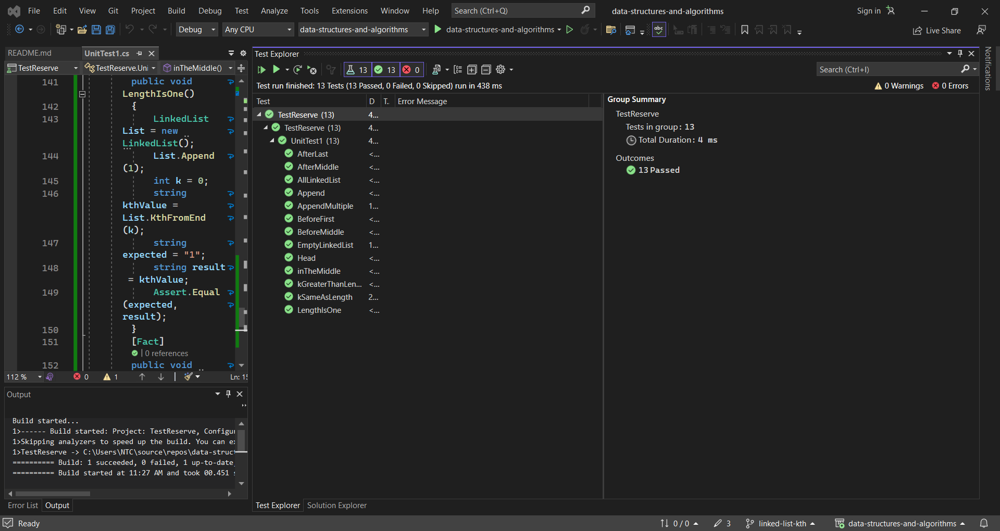

# challenge (7) : link list Kth
## explanation
this is a simple way to make a single link list ,the code provides basic operations for inserting nodes, searching for values, inserting before or after a certain node and generating a string representation of a singly linked list. 
this als can give you the value if you give it an index from the tail backswords to the head :
this is the whiteboard for the problem :
## code:
```c#
using System.Collections.Generic;

namespace data_structures_and_algorithms
{
    
        public class Program
        {
            static void Main(string[] args)
        {//code challenge 6
            Console.WriteLine("CC6");
            LinkedList linkedList = new LinkedList();
            linkedList.Append(1);
            linkedList.Append(3);
            linkedList.Append(4);

            bool exists = linkedList.Includes(3);
            Console.WriteLine($"Value 3 exists: {exists}");
            exists = linkedList.Includes(2);
            Console.WriteLine($"Value 2 exists: {exists}");

            linkedList.InsertBefore(3, 2);
            linkedList.InsertAfter(4, 5);
            Console.WriteLine(linkedList.ToString());
            //code challenge 6
            Console.WriteLine("CC7");
            LinkedList List = new LinkedList();
            List.Append(1);
            List.Append(3); 
            List.Append(8);
            List.Append(2);
            int k = 3;
            string kthValue = List.KthFromEnd(k);
            Console.WriteLine($"Value at {k} places from the tail: {kthValue}");
            Console.WriteLine(List.ToString());
        }
        }

        public class Node
        {
            public int Value { get; set; }
            public Node Next { get; set; }

            public Node(int value)
            {
                Value = value;
                Next = null;
            }
        }

        public class LinkedList
        {
            public Node Head { get; set; }
            public Node Tail { get; set; }

            public LinkedList()
            {
                Head = null;
                Tail = null;
            }

            public void Append(int value)
            {
                Node newNode = new Node(value);
                if (Head == null)
                {
                    Head = newNode;
                    Tail = newNode;
                }
                else
                {
                    Tail.Next = newNode;
                    Tail = newNode;
                }
            }

            public bool Includes(int value)
            {
                Node position = Head;
                while (position != null)
                {
                    if (position.Value == value)
                    {
                        return true;
                    }
                    position = position.Next;
                }
                return false;
            }

        public void InsertBefore(int value, int newValue)
        {
            if (Head == null)
                return;

            if (Head.Value == value)
            {
                Node newNode = new Node(newValue);
                newNode.Next = Head;
                Head = newNode;
                return;
            }

            Node current = Head;
            while (current.Next != null)
            {
                if (current.Next.Value == value)
                {
                    Node newNode = new Node(newValue);
                    newNode.Next = current.Next;
                    current.Next = newNode;
                    return;
                }
                current = current.Next;
            }
        }
        public void InsertAfter(int value, int newValue)
        {
            Node current = Head;
            while (current != null)
            {
                if (current.Value == value)
                {
                    Node newNode = new Node(newValue);
                    newNode.Next = current.Next;
                    current.Next = newNode;
                    if (current == Tail)
                        Tail = newNode;
                    return;
                }
                current = current.Next;
            }
        }
        public string ToString()
            {
                Node current = Head;
                string result = "";
                while (current != null)
                {
                    result += $"{{ {current.Value} }} -> ";
                    current = current.Next;
                }
                result += "NULL";
                return result;
            }
        public string KthFromEnd(int k)
        {
                if (Head == null)
                    return "The linked list is empty.";
                    Node current = Head;
                Node kthNode = Head;

                for (int i = 0; i < k; i++)
                {
                    if (current == null)
                        return "out of range";
                    current = current.Next;
                }
                while (current.Next != null)
                {
                    current = current.Next;
                    kthNode = kthNode.Next;
                }

                return $"{kthNode.Value}";
               
            }
    
        }

           


    }


```

## unit:
```c#
using data_structures_and_algorithms;

namespace TestReserve
{
   
        public class UnitTest1
        {
            [Fact]
            public void EmptyLinkedList()
            {
                LinkedList linkedList = new LinkedList();
                Assert.Equal(null, linkedList.Head);
            }

            [Fact]
            public void Append()
            {
                LinkedList linkedList = new LinkedList();
                linkedList.Append(5);

                Assert.Equal(5, linkedList.Head.Value);
            }

            [Fact]
            public void Head()
            {
                LinkedList linkedList = new LinkedList();
                linkedList.Append(5);
                linkedList.Append(10);
                Assert.Equal(5, linkedList.Head.Value);
            }

            [Fact]
            public void AppendMultiple()
            {
                LinkedList linkedList = new LinkedList();
                linkedList.Append(5);
                linkedList.Append(10);
                linkedList.Append(15);
                Assert.NotNull(linkedList.Tail);
                Assert.Equal(15, linkedList.Tail.Value);
            }

         

            [Fact]
            public void AllLinkedList()
            {
                LinkedList linkedList = new LinkedList();
                linkedList.Append(5);
                linkedList.Append(10);
                linkedList.Append(15);
                string expected = "{ 5 } -> { 10 } -> { 15 } -> NULL";
                string result = linkedList.ToString();
                Assert.Equal(expected, result);
            }
        [Fact]
        public void BeforeMiddle()
        {
            LinkedList linkedList = new LinkedList();
            linkedList.Append(5);
            linkedList.Append(10);
            linkedList.Append(15);
            linkedList.InsertBefore(10, 7);
            string expected = "{ 5 } -> { 7 } -> { 10 } -> { 15 } -> NULL";
            string result = linkedList.ToString();
            Assert.Equal(expected, result);
        }

        [Fact]
        public void BeforeFirst()
        {
            LinkedList linkedList = new LinkedList();
            linkedList.Append(5);
            linkedList.Append(10);
            linkedList.InsertBefore(5, 2);
            string expected = "{ 2 } -> { 5 } -> { 10 } -> NULL";
            string result = linkedList.ToString();
            Assert.Equal(expected, result);
        }

        [Fact]
        public void AfterMiddle()
        {
            LinkedList linkedList = new LinkedList();
            linkedList.Append(5);
            linkedList.Append(10);
            linkedList.Append(15);
            linkedList.InsertAfter(10, 12);
            string expected = "{ 5 } -> { 10 } -> { 12 } -> { 15 } -> NULL";
            string result = linkedList.ToString();
            Assert.Equal(expected, result);
        }

        [Fact]
        public void AfterLast()
        {
            LinkedList linkedList = new LinkedList();
            linkedList.Append(5);
            linkedList.Append(10);
            linkedList.InsertAfter(10, 13);
            string expected = "{ 5 } -> { 10 } -> { 13 } -> NULL";
            string result = linkedList.ToString();
            Assert.Equal(expected, result);
        }

        /// <summary>
        /// test code challenge 7
        /// </summary>
        [Fact]
        public void kGreaterThanLength()
        {
            LinkedList List = new LinkedList();
            List.Append(1);
            List.Append(3);
            List.Append(8);
            List.Append(2);
            int k = 10;
            string kthValue = List.KthFromEnd(k);
            string expected = "out of range";
            string result = kthValue;
            Assert.Equal(expected, result);
        }
        [Fact]
        public void kSameAsLength()
        {
            LinkedList List = new LinkedList();
            List.Append(1);
            List.Append(3);
            List.Append(8);
            List.Append(2);
            int k = 3;
            string kthValue = List.KthFromEnd(k);
            string expected = "1";
            string result = kthValue;
            Assert.Equal(expected, result);
        }
        [Fact]
        public void LengthIsOne()
        {
            LinkedList List = new LinkedList();
            List.Append(1);
            int k = 0;
            string kthValue = List.KthFromEnd(k);
            string expected = "1";
            string result = kthValue;
            Assert.Equal(expected, result);
        }
        [Fact]
        public void inTheMiddle()
        {
            LinkedList List = new LinkedList();
            List.Append(1);
            List.Append(2);
            List.Append(3);
            int k = 1;
            string kthValue = List.KthFromEnd(k);
            string expected = "2";
            string result = kthValue;
            Assert.Equal(expected, result);
        }


    }
}


```



