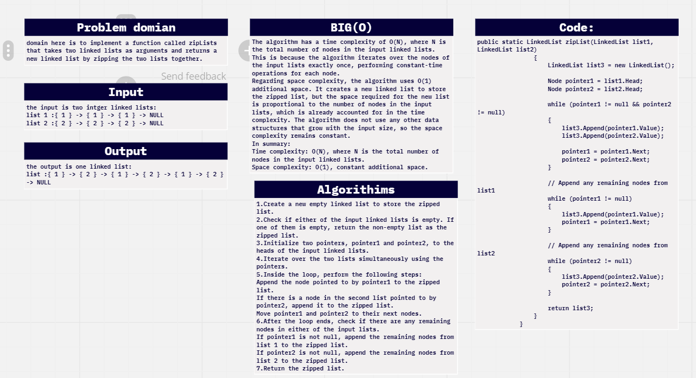


# challenge (7) : link list Zip
## explination
this is simple progeram that tiks 2 integer  linked lists and merge thiem sequeantioaly one from the first and one from the second to amke a outpot of one linked list of thiem.
## code:
```c#
    public static LinkedList zipList(LinkedList list1, LinkedList list2)
                {
                    LinkedList list3 = new LinkedList();

                    Node pointer1 = list1.Head;
                    Node pointer2 = list2.Head;

                    while (pointer1 != null && pointer2 != null)
                    {
                        list3.Append(pointer1.Value);
                        list3.Append(pointer2.Value);

                        pointer1 = pointer1.Next;
                        pointer2 = pointer2.Next;
                    }

                    while (pointer1 != null)
                    {
                        list3.Append(pointer1.Value);
                        pointer1 = pointer1.Next;
                    }

                
                    while (pointer2 != null)
                    {
                        list3.Append(pointer2.Value);
                        pointer2 = pointer2.Next;
                    }

                    return list3;
                }
            }


```

## unit:
```c#
using data_structures_and_algorithms;
using System.Collections.Generic;
using static data_structures_and_algorithms.Program;

namespace TestReserve
{

    public class UnitTest1
    {
        [Fact]
        public void normalAddition()
        {

            LinkedList l1 = new LinkedList();
            l1.Append(1);
            l1.Append(1);
            l1.Append(1);


            LinkedList l2 = new LinkedList();
            l2.Append(2);
            l2.Append(2);
            l2.Append(2);
            LinkedList l3 = new LinkedList();
            l3 = LinkedList.zipList(l1, l2);

            string expected = "{ 1 } -> { 2 } -> { 1 } -> { 2 } -> { 1 } -> { 2 } -> NULL";
            Assert.Equal(expected, l3.ToString());
        }
        [Fact]
        public void notTheSameSize()
        {

            LinkedList l1 = new LinkedList();
            l1.Append(1);
            l1.Append(1);
            l1.Append(1);


            LinkedList l2 = new LinkedList();
            l2.Append(2);
            l2.Append(2);
            l2.Append(2);
            l2.Append(2);
            l2.Append(2);

            LinkedList l3 = LinkedList.zipList(l1, l2);

            string expected = "{ 1 } -> { 2 } -> { 1 } -> { 2 } -> { 1 } -> { 2 } -> { 2 } -> { 2 } -> NULL";
            Assert.Equal(expected, l3.ToString());
        }
        [Fact]
        public void oneIsEmpty()
        {

            LinkedList l1 = new LinkedList();
            LinkedList l2 = new LinkedList();
            l2.Append(2);
            l2.Append(2);
            l2.Append(2);
            l2.Append(2);
            l2.Append(2);

            LinkedList l3 = LinkedList.zipList(l1, l2);

            string expected = "{ 2 } -> { 2 } -> { 2 } -> { 2 } -> { 2 } -> NULL";
            Assert.Equal(expected, l3.ToString());
        }
    }
}

```



