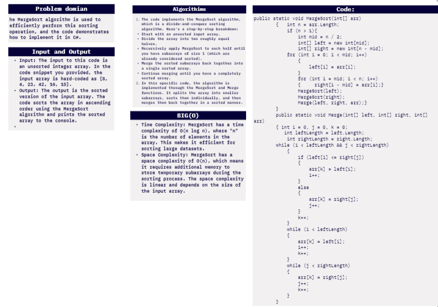
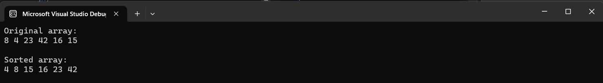
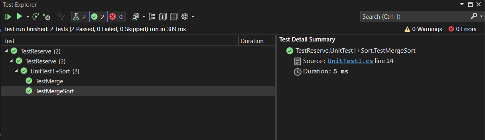

# challenge (27) :Merge Sort
## explanation
the main functionality of the code is to perform a MergeSort on an input array, resulting in a sorted array, and to display both the original and sorted arrays in the console.
## whiteboard:



## walkthrough :

Walkthrough of the Code:

1. **Initial Call to MergeSort**:
   - The initial call is made with the entire input array `arr`.
   - `n` is the length of the array, which is 6 in this case (8, 4, 23, 42, 16, 15).
   - Since `n > 1`, the array is split into two subarrays: `left` and `right`.
   - `left` will contain the elements {8, 4, 23} and `right` will contain {42, 16, 15}.
   - Two recursive calls are made:
     - `MergeSort(left)` is called on the left subarray {8, 4, 23}.
     - `MergeSort(right)` is called on the right subarray {42, 16, 15}.

2. **Recursive Call for `left` (left subarray: {8, 4, 23})**:
   - The length of `left` is 3, so it's further split into smaller subarrays.
   - The subarrays are recursively sorted until they reach subarrays of size 1, which are already considered sorted.
   - The merging step will be performed on these sorted subarrays.

3. **Recursive Call for `right` (right subarray: {42, 16, 15})**:
   - Similar to the left subarray, the right subarray is recursively sorted.
   - Again, the merging step will be performed on the sorted subarrays.

4. **Merging Step**:
   - After the left and right subarrays are sorted, the `Merge` method is called to merge them into a single sorted array.
   - During the merging process, the elements are compared, and the smaller element is placed in the final sorted array `arr`.
   - The `while` loop in the `Merge` method is used to merge the elements from the left and right subarrays in sorted order.

5. **Final Sorted Array**:
   - After all recursive calls and merging steps are complete, you will have a single sorted array stored in the `arr` variable.
   - The sorted array is printed to the console using the `PrintArray` method.

## code:


```c#
namespace data_structures_and_algorithms
{


    public class Program
    {
        static void Main(string[] args)
        {
            {
                int[] arr = { 8,4,23,42,16,15};
                Console.WriteLine("Original array:");
                PrintArray(arr);

                MergeSort(arr);

                Console.WriteLine("\nSorted array:");
                PrintArray(arr);
            }

        }
        public static void MergeSort(int[] arr)
        {
            int n = arr.Length;
            if (n > 1)
            {
                int mid = n / 2;
                int[] left = new int[mid];
                int[] right = new int[n - mid];

                for (int i = 0; i < mid; i++)
                {
                    left[i] = arr[i];
                }

                for (int i = mid; i < n; i++)
                {
                    right[i - mid] = arr[i];
                }

                MergeSort(left);
                MergeSort(right);

                Merge(left, right, arr);
            }
        }

        public static void Merge(int[] left, int[] right, int[] arr)
        {
            int i = 0, j = 0, k = 0;
            int leftLength = left.Length;
            int rightLength = right.Length;

            while (i < leftLength && j < rightLength)
            {
                if (left[i] <= right[j])
                {
                    arr[k] = left[i];
                    i++;
                }
                else
                {
                    arr[k] = right[j];
                    j++;
                }
                k++;
            }

            while (i < leftLength)
            {
                arr[k] = left[i];
                i++;
                k++;
            }

            while (j < rightLength)
            {
                arr[k] = right[j];
                j++;
                k++;
            }
        }

        public static void PrintArray(int[] arr)
        {
            foreach (int num in arr)
            {
                Console.Write(num + " ");
            }
            Console.WriteLine();
        }

    }
}
```
## test unit:



```c#
using static data_structures_and_algorithms.Program;


namespace TestReserve
{

    public class UnitTest1
    {

        public class Sort
        {

            [Fact]
        public void TestMergeSort()
            {
                // Arrange
                int[] arr = { 12, 11, 13, 5, 6, 7 };
                int[] expectedSortedArr = { 5, 6, 7, 11, 12, 13 };

                // Act
                MergeSort(arr);

                // Assert
                Assert.Equal(expectedSortedArr, arr);
            }

            [Fact]
            public void TestMerge()
            {
                int[] left = { 5, 11, 13 };
                int[] right = { 6, 7, 12 };
                int[] expectedMergedArr = { 5, 6, 7, 11, 12, 13 };
                int[] mergedArr = new int[left.Length + right.Length];

                // Act
           Merge(left, right, mergedArr);

                // Assert
                Assert.Equal(expectedMergedArr, mergedArr);
            }
        }
    }
}
```
