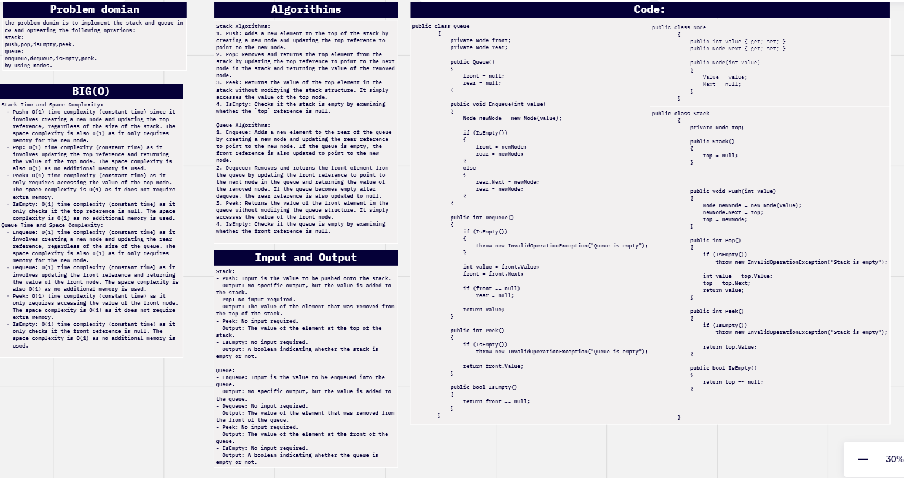
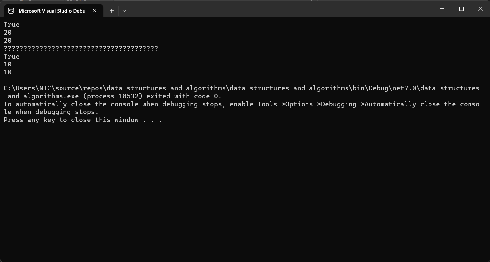
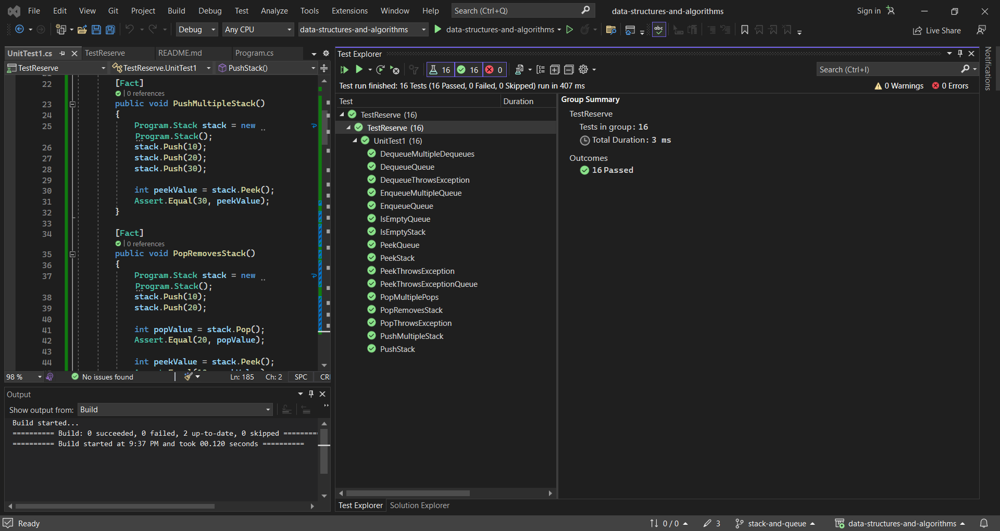

# challenge (10) : Stack & Queue
## explanation
this is a code for stack and queue that operates on the stake and the queue as some operations as for stack : pop , push , isEmpty and peek .
and also the queue has opreatitions such as: Enqueue,Dequeue, isEmpty and peek .

## whiteboard:


## walkthrough :

 walkthrough of the code:

1. The program starts by creating a new instance of the `Stack` class and assigning it to the `stack` variable.

2. It then calls the `IsEmpty` method on the stack and prints the result. Since the stack is newly created, it is empty, so the output will be `True`.

3. Two values, 10 and 20, are pushed onto the stack using the `Push` method.

4. The `Peek` method is called on the stack and the result is stored in the `peekValue` variable. The top value of the stack is 20, so the `peekValue` will be assigned 20.

5. The `peekValue` is printed to the console, so the output will be `20`.

6. The `Pop` method is called on the stack and the result is stored in the `popValue` variable. The top value of the stack is 20, so it will be removed from the stack and assigned to `popValue`.

7. The `popValue` is printed to the console, so the output will be `20`.

8. A message is printed to the console indicating a query section.

9. A new instance of the `Queue` class is created and assigned to the `queue` variable.

10. The `IsEmpty` method is called on the queue and the result is printed to the console. Since the queue is newly created, it is empty, so the output will be `True`.

11. Two values, 10 and 20, are enqueued into the queue using the `Enqueue` method.

12. The `Peek` method is called on the queue and the result is stored in the `peekValueQueue` variable. The front value of the queue is 10, so the `peekValueQueue` will be assigned 10.

13. The `peekValueQueue` is printed to the console, so the output will be `10`.

14. The `Dequeue` method is called on the queue and the result is stored in the `dequeueValue` variable. The front value of the queue is 10, so it will be removed from the queue and assigned to `dequeueValue`.

15. The `dequeueValue` is printed to the console, so the output will be `10`.

## code:
```c#
using System.Collections.Generic;

namespace data_structures_and_algorithms
{


    public class Program
    {
        static void Main(string[] args)
        {
            Stack stack = new Stack();
            Console.WriteLine(stack.IsEmpty());  

            stack.Push(10);
            stack.Push(20);
            int peekValue = stack.Peek();
            Console.WriteLine(peekValue); 

            int popValue = stack.Pop();
            Console.WriteLine(popValue);  
            //query:
            Console.WriteLine("???????????????????????????????????????");  
            Queue queue = new Queue();
            Console.WriteLine(queue.IsEmpty()); 

            queue.Enqueue(10);
            queue.Enqueue(20);
            int peekValueQueue = queue.Peek();
            Console.WriteLine(peekValueQueue); 

            int dequeueValue = queue.Dequeue();
            Console.WriteLine(dequeueValue);  
        }
        public class Node
        {
            public int Value { get; set; }
            public Node Next { get; set; }

            public Node(int value)
            {
                Value = value;
                Next = null;
            }
        }
        public class Stack
        {
            private Node top;

            public Stack()
            {
                top = null;
            }


            public void Push(int value)
            {
                Node newNode = new Node(value);
                newNode.Next = top;
                top = newNode;
            }

            public int Pop()
            {
                if (IsEmpty())
                    throw new InvalidOperationException("Stack is empty");

                int value = top.Value;
                top = top.Next;
                return value;
            }

            public int Peek()
            {
                if (IsEmpty())
                    throw new InvalidOperationException("Stack is empty");

                return top.Value;
            }

            public bool IsEmpty()
            {
                return top == null;
            }


        }


        public class Queue
        {
            private Node front;
            private Node rear;

            public Queue()
            {
                front = null;
                rear = null;
            }

            public void Enqueue(int value)
            {
                Node newNode = new Node(value);

                if (IsEmpty())
                {
                    front = newNode;
                    rear = newNode;
                }
                else
                {
                    rear.Next = newNode;
                    rear = newNode;
                }
            }

            public int Dequeue()
            {
                if (IsEmpty())
                {
                    throw new InvalidOperationException("Queue is empty");
                }

                int value = front.Value;
                front = front.Next;

                if (front == null)
                    rear = null;

                return value;
            }

            public int Peek()
            {
                if (IsEmpty())
                    throw new InvalidOperationException("Queue is empty");

                return front.Value;
            }

            public bool IsEmpty()
            {
                return front == null;
            }
        }


    }
}
```

## unit:


```c#
using data_structures_and_algorithms;
using System.Collections;
using System.Collections.Generic;
using static data_structures_and_algorithms.Program;

namespace TestReserve
{

    public class UnitTest1
    {

        [Fact]
        public void PushStack()
        {
            Program.Stack stack = new Program.Stack();
            stack.Push(10);

            int peekValue = stack.Peek();
            Assert.Equal(10, peekValue);
        }

        [Fact]
        public void PushMultipleStack()
        {
            Program.Stack stack = new Program.Stack();
            stack.Push(10);
            stack.Push(20);
            stack.Push(30);

            int peekValue = stack.Peek();
            Assert.Equal(30, peekValue);
        }

        [Fact]
        public void PopRemovesStack()
        {
            Program.Stack stack = new Program.Stack();
            stack.Push(10);
            stack.Push(20);

            int popValue = stack.Pop();
            Assert.Equal(20, popValue);

            int peekValue = stack.Peek();
            Assert.Equal(10, peekValue);
        }

        [Fact]
        public void PopMultiplePops()
        {
            Program.Stack stack = new Program.Stack();
            stack.Push(10);
            stack.Push(20);
            stack.Push(30);

            stack.Pop();
            stack.Pop();
            stack.Pop();

            bool isEmpty = stack.IsEmpty();
            Assert.True(isEmpty);
        }

        [Fact]
        public void PeekStack()
        {
            Program.Stack stack = new Program.Stack();
            stack.Push(10);
            stack.Push(20);

            int peekValue = stack.Peek();
            Assert.Equal(20, peekValue);
        }

        [Fact]
        public void IsEmptyStack()
        {
            Program.Stack stack = new Program.Stack();
            bool isEmpty = stack.IsEmpty();
            Assert.True(isEmpty);
        }

        [Fact]
        public void PopThrowsException()
        {
            Program.Stack stack = new Program.Stack();
            Assert.Throws<InvalidOperationException>(() => stack.Pop());
        }

        [Fact]
        public void PeekThrowsException()
        {
            Program.Stack stack = new Program.Stack();
            Assert.Throws<InvalidOperationException>(() => stack.Peek());
        }


        [Fact]
        public void EnqueueQueue()
        {
            Program.Queue queue = new Program.Queue();
            queue.Enqueue(10);

            int peekValue = queue.Peek();
            Assert.Equal(10, peekValue);
        }

        [Fact]
        public void EnqueueMultipleQueue()
        {
            Program.Queue queue = new Program.Queue();
            queue.Enqueue(10);
            queue.Enqueue(20);
            queue.Enqueue(30);

            int peekValue = queue.Peek();
            Assert.Equal(10, peekValue);
        }

        [Fact]
        public void DequeueQueue()
        {
            Program.Queue queue = new Program.Queue();
            queue.Enqueue(10);
            queue.Enqueue(20);

            int dequeueValue = queue.Dequeue();
            Assert.Equal(10, dequeueValue);

            int peekValue = queue.Peek();
            Assert.Equal(20, peekValue);
        }

        [Fact]
        public void DequeueMultipleDequeues()
        {
            Program.Queue queue = new Program.Queue();
            queue.Enqueue(10);
            queue.Enqueue(20);
            queue.Enqueue(30);

            queue.Dequeue();
            queue.Dequeue();
            queue.Dequeue();

            bool isEmpty = queue.IsEmpty();
            Assert.True(isEmpty);
        }

        [Fact]
        public void PeekQueue()
        {
            Program.Queue queue = new Program.Queue();
            queue.Enqueue(10);
            queue.Enqueue(20);

            int peekValue = queue.Peek();
            Assert.Equal(10, peekValue);
        }

        [Fact]
        public void IsEmptyQueue()
        {
            Program.Queue queue = new Program.Queue();
            bool isEmpty = queue.IsEmpty();
            Assert.True(isEmpty);
        }

        [Fact]
        public void DequeueThrowsException()
        {
            Program.Queue queue = new Program.Queue();
            Assert.Throws<InvalidOperationException>(() => queue.Dequeue());
        }

        [Fact]
        public void PeekThrowsExceptionQueue()
        {
            Program.Queue queue = new Program.Queue();
            Assert.Throws<InvalidOperationException>(() => queue.Peek());
        }
    }

}
```
