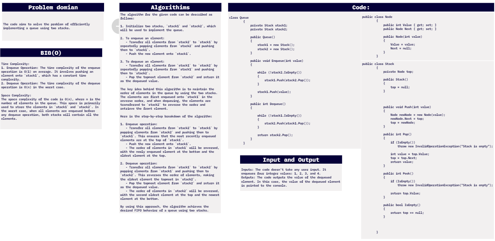

# challenge (11) : Stack & Queue (pseudo)
## explanation
this is a code for stack and queue that operates on the stack and the queue as some operations as for stack : pop , push , isEmpty and peek .
and also the queue has opreatitions such as: Enqueue,Dequeue . using the 2 stacks to do the opreations of Enqueue and Dequeue. 

## whiteboard:


## walkthrough :

 walkthrough of the code:


1. The code starts with the necessary using directives and defines a namespace `data_structures_and_algorithms`.

2. Inside the namespace, there's a class named `Program`, which serves as the entry point of the program with the `Main` method.

3. The `Main` method initializes a queue and performs enqueue and dequeue operations on it.

4. The `Node` class represents a node in a linked list. It has two properties: `Value`, which holds the data of the node, and `Next`, which points to the next node in the linked list. The constructor initializes the node with a given value and sets the `Next` property to null.

5. The `Stack` class represents a stack data structure. It has a private member `top`, which points to the topmost element in the stack. The `Stack` constructor initializes `top` to null.

6. The `Stack` class provides several methods:
   - `Push`: Inserts a new element at the top of the stack by creating a new node and updating the `top` reference.
   - `Pop`: Removes and returns the topmost element from the stack. It checks if the stack is empty and throws an exception if it is.
   - `Peek`: Returns the topmost element from the stack without removing it. It also checks if the stack is empty and throws an exception if it is.
   - `IsEmpty`: Checks if the stack is empty by verifying if the `top` reference is null.

7. The `Queue` class represents a queue data structure implemented using two stacks. It has two private members `stack1` and `stack2`, which are instances of the `Stack` class.

8. The `Queue` class provides two main methods:
   - `Enqueue`: Adds an element to the queue by transferring all elements from `stack2` to `stack1`, pushing the new value to `stack1`, and then transferring all elements back to `stack2`.
   - `Dequeue`: Removes and returns the front element from the queue by transferring all elements from `stack1` to `stack2` and then popping the topmost element from `stack2`.

9. Finally, within the `Main` method, the program creates an instance of the `Queue` class, enqueues the values 1, 2, 3, and 4, and then dequeues an element. The dequeued value is printed to the console.


## code:
```c#

using System.Collections.Generic;

namespace data_structures_and_algorithms
{


    public class Program
    {
        static void Main(string[] args)
        {

            //query:
            Console.WriteLine("???????????????????????????????????????");
            Queue queue = new Queue();

            queue.Enqueue(1);
            queue.Enqueue(2);
            queue.Enqueue(3);
            queue.Enqueue(4);

            int dequeueValue = queue.Dequeue();
            Console.WriteLine(dequeueValue);

        }
        public class Node
        {
            public int Value { get; set; }
            public Node Next { get; set; }

            public Node(int value)
            {
                Value = value;
                Next = null;
            }
        }
        public class Stack
        {
            private Node top;

            public Stack()
            {
                top = null;
            }


            public void Push(int value)
            {
                Node newNode = new Node(value);
                newNode.Next = top;
                top = newNode;
            }

            public int Pop()
            {
                if (IsEmpty())
                    throw new InvalidOperationException("Stack is empty");

                int value = top.Value;
                top = top.Next;
                return value;
            }

            public Node Peek()
            {
                if (IsEmpty())
                    throw new InvalidOperationException("Stack is empty");

                return top;
            }

            public bool IsEmpty()
            {
                return top == null;
            }


        }

        class Queue
        {
            private Stack stack1;
            private Stack stack2;

            public Queue()
            {
                stack1 = new Stack();
                stack2 = new Stack();
            }

            public void Enqueue(int value)
            {

                while (!stack2.IsEmpty())
                {
                    stack1.Push(stack2.Pop());
                }

                stack1.Push(value);
            }

            public int Dequeue()
            {

                while (!stack1.IsEmpty())
                {
                    stack2.Push(stack1.Pop());
                }

                return stack2.Pop();
            }
        }


    }
}


```

