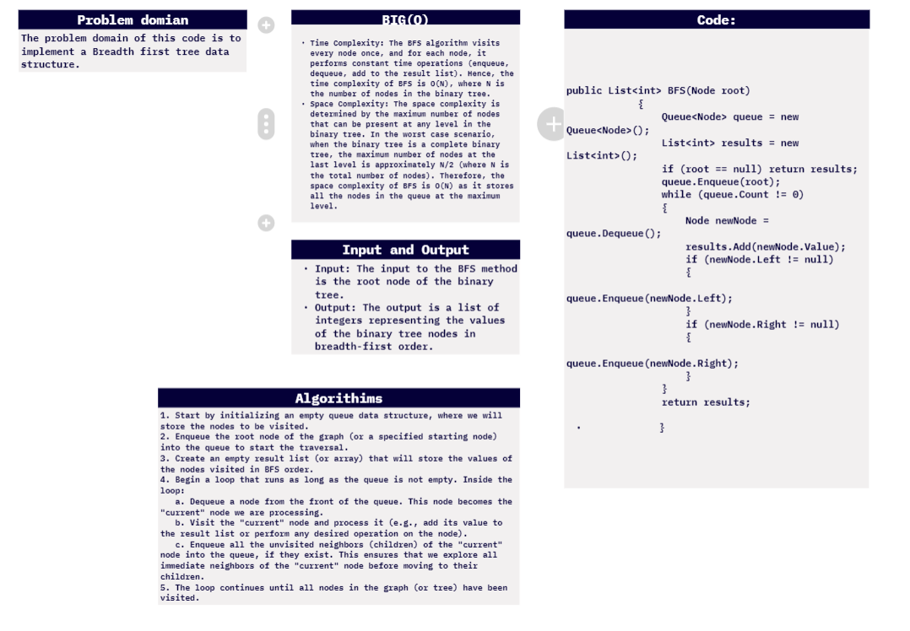
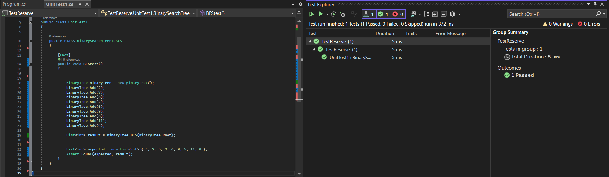

# challenge (17) : breadth-first
## explanation
The BFS method is a tree traversal technique that visits all the nodes of a binary tree in breadth-first order, i.e., level by level. It starts at the root node, explores all the nodes at the current level, and then moves to the next level. This is achieved by using a queue data structure to keep track of the nodes to be visited. BFS is useful for tasks such as finding the shortest path between two nodes or exploring all the nodes in a connected component of a graph.

## whitebourd:


## walkthrough :

Walkthrough of the Code:
a. Create an empty queue data structure.
b. Enqueue the root node into the queue.
c. While the queue is not empty, repeat steps d-f.
d. Dequeue a node from the queue.
e. Visit the dequeued node and process it (e.g., add its value to the result list).
f. Enqueue the left and right children of the dequeued node if they exist.
g. When the queue becomes empty, the BFS traversal is complete.
```c#
namespace data_structures_and_algorithms
{


    public class Program
    {
        static void Main(string[] args)
        {
            {
                BinaryTree binaryTree = new BinaryTree();
                binaryTree.Add(2);
                binaryTree.Add(7);
                binaryTree.Add(5);
                binaryTree.Add(2);
                binaryTree.Add(6);
                binaryTree.Add(9);
                binaryTree.Add(5);
                binaryTree.Add(11);
                binaryTree.Add(4);
                Console.WriteLine("Breadth-First Traversal: " + string.Join(" ", binaryTree.BFS(binaryTree.Root)));

            }

        }

        public class Node
        {
            public int Value { get; set; }

            public Node Left { get; set; }

            public Node Right { get; set; }

            public Node(int value)
            {
                Value = value;
                Left = null;
                Right = null;
            }
        }
        public class BinaryTree
        {
            public Node Root;

            public BinaryTree()
            {
                Root = null;
            }

            public List<int> PreOrderTravarsel()
            {
                List<int> result = new List<int>();
                PreOrderTravarsel(Root, result);

                return result;
            }

            public void PreOrderTravarsel(Node node, List<int> result)
            {
                if (node != null)
                {
                    result.Add(node.Value);

                    PreOrderTravarsel(node.Left, result);

                    PreOrderTravarsel(node.Right, result);
                }

            }

            public List<int> InorderTraversal()
            {
                List<int> result = new List<int>();
                InorderTraversal(Root, result);
                return result;
            }

            private void InorderTraversal(Node node, List<int> result)
            {
                if (node != null)
                {
                    InorderTraversal(node.Left, result);
                    result.Add(node.Value);
                    InorderTraversal(node.Right, result);
                }
            }


            public List<int> PostorderTraversal()
            {
                List<int> result = new List<int>();
                PostorderTraversal(Root, result);
                return result;
            }

            private void PostorderTraversal(Node node, List<int> result)
            {
                if (node != null)
                {
                    PostorderTraversal(node.Left, result);
                    PostorderTraversal(node.Right, result);
                    result.Add(node.Value);
                }
            }
            public int Max_tree()
            {
                return Max_tree(Root);
            }
            private int Max_tree(Node Root)
            {
                if (Root == null)
                {
                    return 0;
                }
                else
                {
                    int max = Root.Value;
                    int lMax = Max_tree(Root.Left);
                    int rMax = Max_tree(Root.Right);
                    if (max < lMax)
                    {
                        max = lMax;
                    }
                    if (max < rMax)
                    {
                        max = rMax;

                    }
                    return max;

                }

            }

            public List<int> BFS(Node root)
            {
                Queue<Node> queue = new Queue<Node>();
                List<int> results = new List<int>();
                if (root == null) return results;
                queue.Enqueue(root);
                while (queue.Count != 0)
                {
                    Node newNode = queue.Dequeue();
                    results.Add(newNode.Value);
                    if (newNode.Left != null)
                    {
                        queue.Enqueue(newNode.Left);
                    }
                    if (newNode.Right != null)
                    {
                        queue.Enqueue(newNode.Right);
                    }
                }
                return results;

            }
            public void Add(int value)
            {
                Root = AddRecursive(Root, value);
            }

            private Node AddRecursive(Node current, int value)
            {
                if (current == null)
                {
                    return new Node(value);
                }


                if (current.Left == null)
                {
                    current.Left = new Node(value);
                }

                else if (current.Right == null)
                {
                    current.Right = new Node(value);
                }

                else
                {
                    current.Left = AddRecursive(current.Left, value);
                }

                return current;
            }
        }
    }
}

```
## test unit:


```c#
using static data_structures_and_algorithms.Program;


namespace TestReserve
{

    public class UnitTest1
    {

        public class BinarySearchTreeTests
        {

            [Fact]
            public void BFStest()
            {


                BinaryTree binaryTree = new BinaryTree();
                binaryTree.Add(2);
                binaryTree.Add(7);
                binaryTree.Add(5);
                binaryTree.Add(2);
                binaryTree.Add(6);
                binaryTree.Add(9);
                binaryTree.Add(5);
                binaryTree.Add(11);
                binaryTree.Add(4);

                List<int> result = binaryTree.BFS(binaryTree.Root);


                List<int> expected = new List<int> { 2, 7, 5, 2, 6, 9, 5, 11, 4 };
                Assert.Equal(expected, result);
            }
        }
    }
}
```
