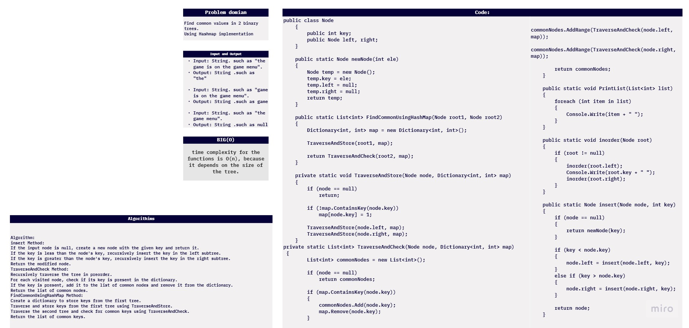
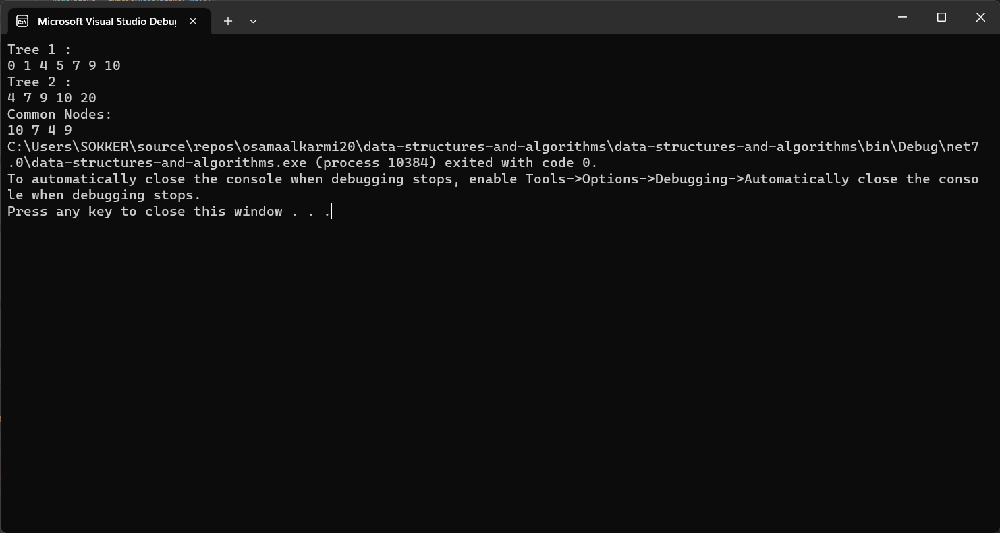
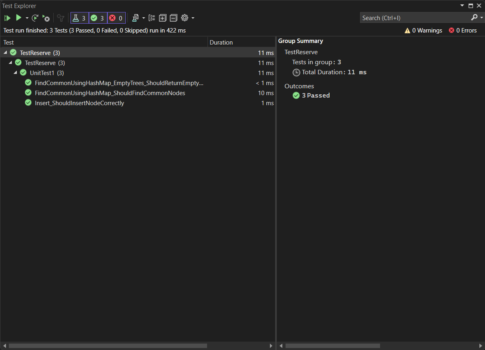

# challenge (32) : Tree Intersection
## explanation
 the code demonstrates the Implemintation of hashMap on two binary trees  find the common  nodes in the tree.


 

## Step by step explanation:

1. **Node Class**:
   - The program defines a `Node` class to represent the nodes of the binary search tree (BST). Each `Node` has an integer `key`, a reference to its left child (`left`), and a reference to its right child (`right`).

2. **newNode Function**:
   - The `newNode` function creates a new `Node` with the given integer value and initializes its `left` and `right` references to `null`. It returns the newly created `Node`.

3. **insert Function**:
   - The `insert` function is used to insert a new node with a given key into a BST. It recursively traverses the tree and inserts the new node at the appropriate position based on the key.

4. **TraverseAndStore Function**:
   - This function recursively traverses the first tree (rooted at `root1`) and stores its node values in a `Dictionary<int, int> map`. The dictionary is used to keep track of the nodes visited in the first tree.

5. **TraverseAndCheck Function**:
   - This function recursively traverses the second tree (rooted at `root2`) and checks if the node's key exists in the `map`. If it does, the node's key is added to a `List<int>` called `commonNodes`, and the key is removed from the `map`. This way, it identifies common nodes between the two trees.

6. **FindCommonUsingHashMap Function**:
   - This function is the main logic for finding common nodes between two BSTs. It first initializes an empty `Dictionary<int, int> map`. Then, it calls `TraverseAndStore` to populate the `map` with nodes from the first tree. Next, it calls `TraverseAndCheck` on the second tree, which identifies and adds common nodes to the `commonNodes` list.

7. **PrintList Function**:
   - This function takes a list of integers (`commonNodes`) as input and prints its elements one by one separated by spaces.

8. **inorder Function**:
   - This is a utility function that performs an inorder traversal of a BST. It prints the keys of the nodes in sorted order.

9. **Main Function**:
   - In the `Main` function:
      - Two BSTs (`root1` and `root2`) are created and populated with values.
      - The keys of the nodes in both trees are printed using the `inorder` function.
      - The common nodes between the two trees are found using the `FindCommonUsingHashMap` function.
      - The common nodes are printed using the `PrintList` function.



## code:
```c#
using System;
using System.Collections.Generic;

namespace data_structures_and_algorithms
{
    public class Program
    {
        public class Node
        {
            public int key;
            public Node left, right;
        }

        public static Node newNode(int ele)
        {
            Node temp = new Node();
            temp.key = ele;
            temp.left = null;
            temp.right = null;
            return temp;
        }

        public static List<int> FindCommonUsingHashMap(Node root1, Node root2)
        {
            Dictionary<int, int> map = new Dictionary<int, int>();

            TraverseAndStore(root1, map);

            return TraverseAndCheck(root2, map);
        }

        private static void TraverseAndStore(Node node, Dictionary<int, int> map)
        {
            if (node == null)
                return;

            if (!map.ContainsKey(node.key))
                map[node.key] = 1;

            TraverseAndStore(node.left, map);
            TraverseAndStore(node.right, map);
        }

        private static List<int> TraverseAndCheck(Node node, Dictionary<int, int> map)
        {
            List<int> commonNodes = new List<int>();

            if (node == null)
                return commonNodes;

            if (map.ContainsKey(node.key))
            {
                commonNodes.Add(node.key);
                map.Remove(node.key);
            }

            commonNodes.AddRange(TraverseAndCheck(node.left, map));
            commonNodes.AddRange(TraverseAndCheck(node.right, map));

            return commonNodes;
        }

        public static void PrintList(List<int> list)
        {
            foreach (int item in list)
            {
                Console.Write(item + " ");
            }
        }

        public static void inorder(Node root)
        {
            if (root != null)
            {
                inorder(root.left);
                Console.Write(root.key + " ");
                inorder(root.right);
            }
        }

        public static Node insert(Node node, int key)
        {
            if (node == null)
            {
                return newNode(key);
            }

            if (key < node.key)
            {
                node.left = insert(node.left, key);
            }
            else if (key > node.key)
            {
                node.right = insert(node.right, key);
            }

            return node;
        }

        public static void Main(string[] args)
        {
            Node root1 = null;
            root1 = insert(root1, 5);
            root1 = insert(root1, 1);
            root1 = insert(root1, 10);
            root1 = insert(root1, 0);
            root1 = insert(root1, 4);
            root1 = insert(root1, 7);
            root1 = insert(root1, 9);

            Node root2 = null;
            root2 = insert(root2, 10);
            root2 = insert(root2, 7);
            root2 = insert(root2, 20);
            root2 = insert(root2, 4);
            root2 = insert(root2, 9);

            Console.Write("Tree 1 : " + "\n");
            inorder(root1);
            Console.WriteLine();
            Console.Write("Tree 2 : " + "\n");
            inorder(root2);
            Console.WriteLine();
            Console.Write("Common Nodes: " + "\n");

            List<int> commonNodes = FindCommonUsingHashMap(root1, root2);
            PrintList(commonNodes);
        }
    }
}
```

## test:
```c#

using data_structures_and_algorithms;
using static data_structures_and_algorithms.Program;

namespace TestReserve
{

    public class UnitTest1
    {

        [Fact]
        public void FindCommonUsingHashMap_ShouldFindCommonNodes()
        {

            Node root1 = null;
            root1 = insert(root1, 5);
            root1 = insert(root1, 1);
            root1 = insert(root1, 10);
            root1 = insert(root1, 0);
            root1 = insert(root1, 4);
            root1 = insert(root1, 7);
            root1 = insert(root1, 9);

            Node root2 = null;
            root2 = insert(root2, 10);
            root2 = insert(root2, 7);
            root2 = insert(root2, 20);
            root2 = insert(root2, 4);
            root2 = insert(root2, 9);

            List<int> expectedCommonNodes = new List<int> { 10, 7, 4, 9 };


            List<int> actualCommonNodes = FindCommonUsingHashMap(root1, root2);

            Assert.Equal(expectedCommonNodes, actualCommonNodes);
        }

        [Fact]
        public void Insert_ShouldInsertNodeCorrectly()
        {

            Node root = null;
            root = insert(root, 5);

            Node newNode = insert(root, 3);

            Assert.Equal(5, newNode.key);
            Assert.NotNull(newNode.left);
            Assert.Null(newNode.right);
        }


        [Fact]
        public void FindCommonUsingHashMap_EmptyTrees_ShouldReturnEmptyList()
        {

            Node root1 = null;
            Node root2 = null;


            List<int> actualCommonNodes = FindCommonUsingHashMap(root1, root2);

            Assert.Empty(actualCommonNodes);
        }
    }
}

```
