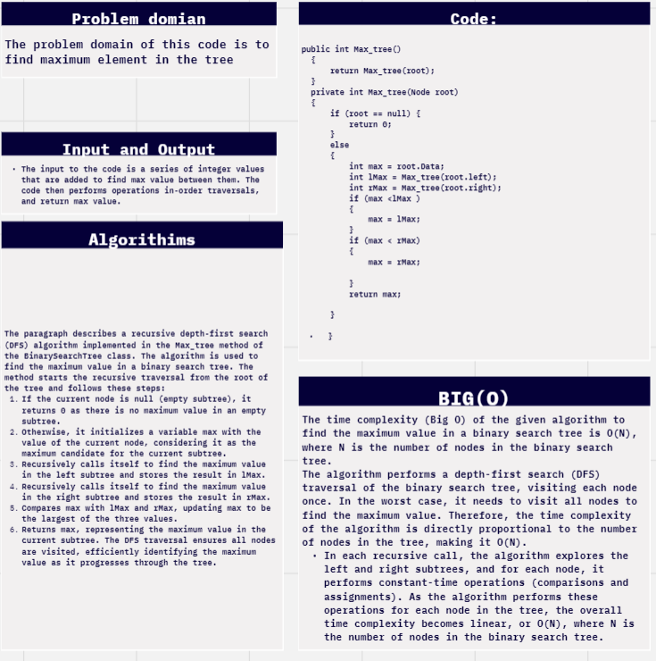

# challenge (16) :tree-max
## explanation
The Max_tree method is a recursive method that finds the maximum value in the binary search tree. It starts by calling the private overloaded method Max_tree(Node Root) with the root of the binary tree as the starting node.
## whiteboard:



## walkthrough :

Walkthrough of the Code:
The Max_tree method is called from the Main method with the root node of the binary search tree, which has the value 50. It serves as the starting point for the recursion.

The private recursive method Max_tree(Node Root) is called with the root node (50) as the argument.

In the recursive method, since the current node Root (with value 50) is not null, we proceed to find the maximum value in the binary search tree.

We start by setting the initial maximum value max to the value of the current node (Root.Value = 50). This means that currently, the maximum value is 50.

Next, we recursively call Max_tree to find the maximum value in the left subtree of the current node (Root).

The left subtree rooted at 30 is explored.

We set max to 30 (the value of the current node).

Next, we recursively call Max_tree with the left child of 30, which is 20.

The left child of 20 is null, so we reach the base case of the recursion. The method returns 0.

The value 0 returned from the left subtree doesn't change the current max value, so max remains 30.

After exploring the left subtree, we now explore the right subtree of the current node (Root).

The right subtree rooted at 70 is explored.

We set max to 70 (the value of the current node).

Next, we recursively call Max_tree with the left child of 70, which is 60.

The left child of 60 is null, so we reach the base case of the recursion. The method returns 0.

The value 0 returned from the left subtree doesn't change the current max value, so max remains 70.

Now that we have explored both the left and right subtrees of the current node (Root), we compare the max value (70) with the values returned from the left and right subtrees (30 and 70).

Since max is less than lMax (which is 30), we update max to 30.

Since max is also less than rMax (which is 70), we don't update max further.

The method returns the final max value, which is 30, to the calling code.

In the Main method, the value 30 is printed to the console as the maximum value in the binary search tree.
```c#


using static data_structures_and_algorithms.Program.BinaryTree;

namespace data_structures_and_algorithms
{


    public class Program
    {
        static void Main(string[] args)
        {
            {

                BinarySearchTree binarySeartchTree = new BinarySearchTree();

                binarySeartchTree.Add(50);
                binarySeartchTree.Add(30);
                binarySeartchTree.Add(70);
                binarySeartchTree.Add(20);
                binarySeartchTree.Add(40);
                binarySeartchTree.Add(60);
                binarySeartchTree.Add(80);


                Console.WriteLine("Pre-Order Traversal");

                string resultString = string.Join(",", binarySeartchTree.PreOrderTravarsel());
                Console.WriteLine(resultString);
                

                Console.WriteLine("In-order Traversal");
                Console.WriteLine(string.Join(", ", binarySeartchTree.InorderTraversal()));

                Console.WriteLine("Post-order Traversal");
                Console.WriteLine(string.Join(", ", binarySeartchTree.PostorderTraversal()));
                Console.WriteLine(binarySeartchTree.Max_tree());
            }

        }

        public class Node
        {
            public int Value { get; set; }

            public Node Left { get; set; }

            public Node Right { get; set; }

            public Node(int value)
            {
                Value = value;
                Left = null;
                Right = null;
            }
        }
        public class BinaryTree
        {
            public Node Root;

            public BinaryTree()
            {
                Root = null;
            }

            public List<int> PreOrderTravarsel()
            {
                List<int> result = new List<int>();
                PreOrderTravarsel(Root, result);

                return result;
            }

            public void PreOrderTravarsel(Node node, List<int> result)
            {
                if (node != null)
                {
                    result.Add(node.Value);

                    PreOrderTravarsel(node.Left, result);

                    PreOrderTravarsel(node.Right, result);
                }

            }

            public List<int> InorderTraversal()
            {
                List<int> result = new List<int>();
                InorderTraversal(Root, result);
                return result;
            }

            private void InorderTraversal(Node node, List<int> result)
            {
                if (node != null)
                {
                    InorderTraversal(node.Left, result);
                    result.Add(node.Value);
                    InorderTraversal(node.Right, result);
                }
            }


            public List<int> PostorderTraversal()
            {
                List<int> result = new List<int>();
                PostorderTraversal(Root, result);
                return result;
            }

            private void PostorderTraversal(Node node, List<int> result)
            {
                if (node != null)
                {
                    PostorderTraversal(node.Left, result);
                    PostorderTraversal(node.Right, result);
                    result.Add(node.Value);
                }
            }
            public int Max_tree()
            {
                return Max_tree(Root);
            }
            private int Max_tree(Node Root)
            {
                if (Root == null)
                {
                    return 0;
                }
                else
                {
                    int max = Root.Value;
                    int lMax = Max_tree(Root.Left);
                    int rMax = Max_tree(Root.Right);
                    if (max < lMax)
                    {
                        max = lMax;
                    }
                    if (max < rMax)
                    {
                        max = rMax;

                    }
                    return max;

                }

            }
            public class BinarySearchTree : BinaryTree
            {

                public void Add(int value)
                {
                    Root = AddNode(Root, value);
                }
                private Node AddNode(Node node, int value)
                {
                    if (node == null)
                        return new Node(value);


                    if (value.CompareTo(node.Value) < 0)
                        node.Left = AddNode(node.Left, value);

                    else if (value.CompareTo(node.Value) > 0)
                        node.Right = AddNode(node.Right, value);

                    return node;
                }
                public bool Contains(int value)
                {
                    return ContainsNode(Root, value);
                }

                private bool ContainsNode(Node node, int value)
                {
                    if (node == null)
                        return false;

                    int comparisonResult = value.CompareTo(node.Value);
                    if (comparisonResult == 0)
                        return true;
                    else if (comparisonResult < 0)
                        return ContainsNode(node.Left, value);
                    else
                        return ContainsNode(node.Right, value);

                }
            }
        }
    }
    }


```
## test unit:


```c#
using data_structures_and_algorithms;
using System.Collections;
using System.Collections.Generic;
using static data_structures_and_algorithms.Program;
using static data_structures_and_algorithms.Program.BinaryTree;

namespace TestReserve
{

    public class UnitTest1
    {
       
        public class BinarySearchTreeTests
        {
            [Fact]
            public void TestEmptyTree()
            {
                BinarySearchTree testTree = new BinarySearchTree();
                Assert.False(testTree.Contains(5));
            }
            private BinarySearchTree CreateBinarySearchTree()
            {
                BinarySearchTree testTree = new BinarySearchTree();
                testTree.Add(100);
                testTree.Add(50);
                testTree.Add(200);
                testTree.Add(25);
                testTree.Add(75);
                testTree.Add(150);
                testTree.Add(300);
                testTree.Add(60);
                testTree.Add(90);
                testTree.Add(342);
                return testTree;
            }

            [Fact]
            public void HappyPath()
            {
                
               BinarySearchTree testTree = CreateBinarySearchTree();

                int result = testTree.Max_tree();

                Assert.Equal(342, result);
            }

            [Fact]
            public void Max_tree_TreeIsEmpty()
            {
              
                BinarySearchTree testTree = new BinarySearchTree();

                int result = testTree.Max_tree();

                Assert.Equal(0, result);
            }

            [Fact]
            public void Max_tree_WhenSingleNodeTree()
            {
              
                BinarySearchTree testTree = new BinarySearchTree();
                testTree.Add(42);

               
                int result = testTree.Max_tree();

               
                Assert.Equal(42, result);
            }
        }
    }
        }
 
```
