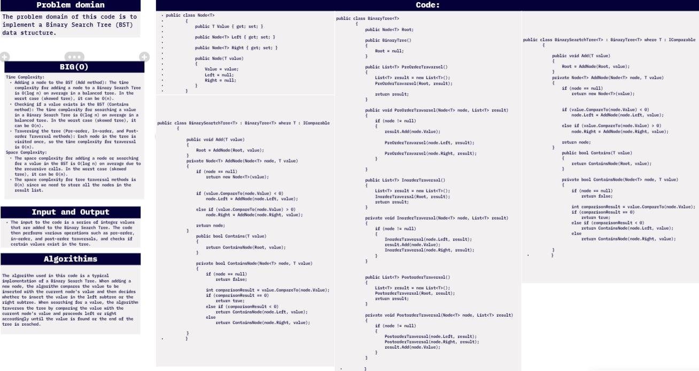
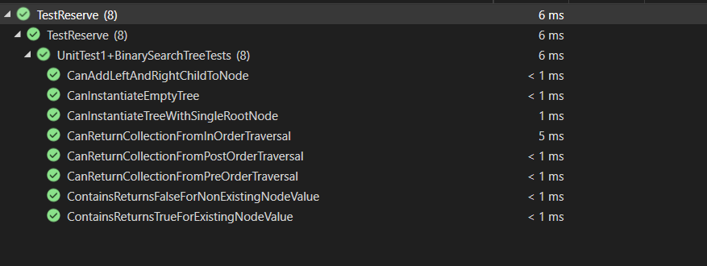

# challenge (15) :tree
## explanation
The code defines a Node class to represent each node in the Binary Search Tree.
It also defines a BinaryTree class with methods for pre-order, in-order, and post-order traversals.
The BinarySearchTree class extends the BinaryTree class and adds an Add method to insert nodes into the BST and a Contains method to check if a value exists in the tree.
In the Main method, a BinarySearchTree instance is created, and several integer values are added to the tree using the Add method.
The code then performs pre-order, in-order, and post-order traversals and prints the results.
Finally, the code checks if certain values (40 and 90) exist in the tree using the Contains method and prints the results.

## whiteboard:



## walkthrough :

Walkthrough of the Code:


1. Namespace and Class Definitions:
   - The code is placed in the "data_structures_and_algorithms" namespace.
   - It defines a `Program` class containing the `Main` method, which serves as the entry point of the program.

2. Binary Search Tree Implementation:
   - The code defines a generic class `BinarySearchTree<T>`, where `T` represents the type of data the BST will store. This class inherits from another generic class `BinaryTree<T>`.

3. Node Class:
   - The code defines a generic `Node<T>` class to represent individual nodes in the Binary Search Tree. Each node contains a `Value`, `Left`, and `Right` reference pointing to its value and its left and right children, respectively.

4. BinaryTree Class:
   - The `BinaryTree<T>` class provides a basic structure for a binary tree. It contains a `Root` reference pointing to the root node of the tree.
   - The class provides methods for Pre-order, In-order, and Post-order traversals using recursive approaches. These methods fill a list with the node values in the specified order.

5. BinarySearchTree Class:
   - The `BinarySearchTree<T>` class extends the `BinaryTree<T>` class, adding the functionality specific to a Binary Search Tree.
   - It provides an `Add` method to insert nodes into the Binary Search Tree. The method compares the new value with the current node's value to determine whether to insert it in the left or right subtree.
   - It also provides a `Contains` method to check if a given value exists in the Binary Search Tree. The method traverses the tree following a similar comparison process as the `Add` method.

6. Main Method:
   - Inside the `Main` method, a new instance of `BinarySearchTree<int>` is created, representing an integer-based Binary Search Tree.
   - Several integer values are added to the tree using the `Add` method, creating a balanced Binary Search Tree.

7. Traversals and Output:
   - The program then performs three different tree traversals: Pre-order, In-order, and Post-order.
   - The results of each traversal are printed to the console, displaying the node values in the specified order.
   - For example, the Pre-order traversal prints the nodes in the order they are visited (Root, Left, Right), the In-order traversal prints them in ascending order, and the Post-order traversal prints them in the order (Left, Right, Root).

8. Value Existence Check:
   - Finally, the program checks whether certain values (40 and 90) exist in the Binary Search Tree using the `Contains` method.
   - The results of these checks are printed to the console, displaying whether the values are found in the tree or not.

In summary, this code provides an implementation of a Binary Search Tree and demonstrates its functionality by adding nodes, performing different tree traversals, and checking for the existence of specific values in the tree.

## code:
```c#


namespace data_structures_and_algorithms
{


    public class Program
    {
        static void Main(string[] args)
        {
            {

                BinarySeartchTree<int> binarySeartchTree = new BinarySeartchTree<int>();

                binarySeartchTree.Add(50);
                binarySeartchTree.Add(30);
                binarySeartchTree.Add(70);
                binarySeartchTree.Add(20);
                binarySeartchTree.Add(40);
                binarySeartchTree.Add(60);
                binarySeartchTree.Add(80);


                Console.WriteLine("Pre-Order Traversal");

                string resultString = string.Join(",", binarySeartchTree.PreOrderTravarsel());
                Console.WriteLine(resultString);


                Console.WriteLine("In-order Traversal");
                Console.WriteLine(string.Join(", ", binarySeartchTree.InorderTraversal()));

                Console.WriteLine("Post-order Traversal");
                Console.WriteLine(string.Join(", ", binarySeartchTree.PostorderTraversal()));
            }

        }

        public class Node<T>
        {
            public T Value { get; set; }

            public Node<T> Left { get; set; }

            public Node<T> Right { get; set; }

            public Node(T value)
            {
                Value = value;
                Left = null;
                Right = null;
            }
        }
        public class BinaryTree<T>
        {
            public Node<T> Root;

            public BinaryTree()
            {
                Root = null;
            }

            public List<T> PreOrderTravarsel()
            {
                List<T> result = new List<T>();
                PreOrderTravarsel(Root, result);

                return result;
            }

            public void PreOrderTravarsel(Node<T> node, List<T> result)
            {
                if (node != null)
                {
                    result.Add(node.Value);

                    PreOrderTravarsel(node.Left, result);

                    PreOrderTravarsel(node.Right, result);
                }

            }

            public List<T> InorderTraversal()
            {
                List<T> result = new List<T>();
                InorderTraversal(Root, result);
                return result;
            }

            private void InorderTraversal(Node<T> node, List<T> result)
            {
                if (node != null)
                {
                    InorderTraversal(node.Left, result);
                    result.Add(node.Value);
                    InorderTraversal(node.Right, result);
                }
            }

         
            public List<T> PostorderTraversal()
            {
                List<T> result = new List<T>();
                PostorderTraversal(Root, result);
                return result;
            }

            private void PostorderTraversal(Node<T> node, List<T> result)
            {
                if (node != null)
                {
                    PostorderTraversal(node.Left, result);
                    PostorderTraversal(node.Right, result);
                    result.Add(node.Value);
                }
            }

        }
        public class BinarySeartchTree<T> : BinaryTree<T> where T : IComparable
        {

            public void Add(T value)
            {
                Root = AddNode(Root, value);
            }
            private Node<T> AddNode(Node<T> node, T value)
            {
                if (node == null)
                    return new Node<T>(value);


                if (value.CompareTo(node.Value) < 0)
                    node.Left = AddNode(node.Left, value);

                else if (value.CompareTo(node.Value) > 0)
                    node.Right = AddNode(node.Right, value);

                return node;
            }
                public bool Contains(T value)
                {
                    return ContainsNode(Root, value);
                }

                private bool ContainsNode(Node<T> node, T value)
                {
                    if (node == null)
                        return false;

                    int comparisonResult = value.CompareTo(node.Value);
                    if (comparisonResult == 0)
                        return true;
                    else if (comparisonResult < 0)
                        return ContainsNode(node.Left, value);
                    else
                        return ContainsNode(node.Right, value);
                
            }
        }
    }


}

```
## test unit:



```c#
using data_structures_and_algorithms;
using System.Collections;
using System.Collections.Generic;
using static data_structures_and_algorithms.Program;

namespace TestReserve
{

    public class UnitTest1
    {
       
        public class BinarySearchTreeTests
        {
            [Fact]
            public void CanInstantiateEmptyTree()
            {
                // Arrange
                BinarySeartchTree<int> binarySearchTree = new BinarySeartchTree<int>();

                // Act & Assert
                Assert.Null(binarySearchTree.Root);
            }

            [Fact]
            public void CanInstantiateTreeWithSingleRootNode()
            {
                // Arrange
                BinarySeartchTree<int> binarySearchTree = new BinarySeartchTree<int>();
                int rootValue = 50;

                // Act
                binarySearchTree.Add(rootValue);

                // Assert
                Assert.NotNull(binarySearchTree.Root);
                Assert.Equal(rootValue, binarySearchTree.Root.Value);
                Assert.Null(binarySearchTree.Root.Left);
                Assert.Null(binarySearchTree.Root.Right);
            }

            [Fact]
            public void CanAddLeftAndRightChildToNode()
            {
                // Arrange
                BinarySeartchTree<int> binarySearchTree = new BinarySeartchTree<int>();
                int rootValue = 50;
                int leftChildValue = 30;
                int rightChildValue = 70;

                // Act
                binarySearchTree.Add(rootValue);
                binarySearchTree.Add(leftChildValue);
                binarySearchTree.Add(rightChildValue);

                // Assert
                Assert.NotNull(binarySearchTree.Root.Left);
                Assert.NotNull(binarySearchTree.Root.Right);
                Assert.Equal(leftChildValue, binarySearchTree.Root.Left.Value);
                Assert.Equal(rightChildValue, binarySearchTree.Root.Right.Value);
            }

            [Fact]
            public void CanReturnCollectionFromPreOrderTraversal()
            {
                // Arrange
                BinarySeartchTree<int> binarySearchTree = new BinarySeartchTree<int>();
                binarySearchTree.Add(50);
                binarySearchTree.Add(30);
                binarySearchTree.Add(70);
                binarySearchTree.Add(20);
                binarySearchTree.Add(40);
                binarySearchTree.Add(60);
                binarySearchTree.Add(80);

                // Act
                var result = binarySearchTree.PreOrderTravarsel();

                // Assert
                int[] expected = new int[] { 50, 30, 20, 40, 70, 60, 80 };
                Assert.Equal(expected, result);
            }

            [Fact]
            public void CanReturnCollectionFromInOrderTraversal()
            {
                // Arrange
                BinarySeartchTree<int> binarySearchTree = new BinarySeartchTree<int>();
                binarySearchTree.Add(50);
                binarySearchTree.Add(30);
                binarySearchTree.Add(70);
                binarySearchTree.Add(20);
                binarySearchTree.Add(40);
                binarySearchTree.Add(60);
                binarySearchTree.Add(80);

                // Act
                var result = binarySearchTree.InorderTraversal();

                // Assert
                int[] expected = new int[] { 20, 30, 40, 50, 60, 70, 80 };
                Assert.Equal(expected, result);
            }

            [Fact]
            public void CanReturnCollectionFromPostOrderTraversal()
            {
                // Arrange
                BinarySeartchTree<int> binarySearchTree = new BinarySeartchTree<int>();
                binarySearchTree.Add(50);
                binarySearchTree.Add(30);
                binarySearchTree.Add(70);
                binarySearchTree.Add(20);
                binarySearchTree.Add(40);
                binarySearchTree.Add(60);
                binarySearchTree.Add(80);

                // Act
                var result = binarySearchTree.PostorderTraversal();

                // Assert
                int[] expected = new int[] { 20, 40, 30, 60, 80, 70, 50 };
                Assert.Equal(expected, result);
            }

            [Fact]
            public void ContainsReturnsTrueForExistingNodeValue()
            {
                // Arrange
                BinarySeartchTree<int> binarySearchTree = new BinarySeartchTree<int>();
                binarySearchTree.Add(50);
                binarySearchTree.Add(30);
                binarySearchTree.Add(70);
                binarySearchTree.Add(20);
                binarySearchTree.Add(40);
                binarySearchTree.Add(60);
                binarySearchTree.Add(80);

                // Act
                bool result = binarySearchTree.Contains(40);

                // Assert
                Assert.True(result);
            }

            [Fact]
            public void ContainsReturnsFalseForNonExistingNodeValue()
            {
                // Arrange
                BinarySeartchTree<int> binarySearchTree = new BinarySeartchTree<int>();
                binarySearchTree.Add(50);
                binarySearchTree.Add(30);
                binarySearchTree.Add(70);
                binarySearchTree.Add(20);
                binarySearchTree.Add(40);
                binarySearchTree.Add(60);
                binarySearchTree.Add(80);

                // Act
                bool result = binarySearchTree.Contains(90);

                // Assert
                Assert.False(result);
            }
        }
    }


}


```
